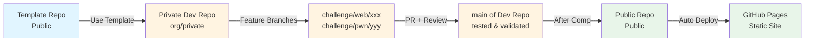
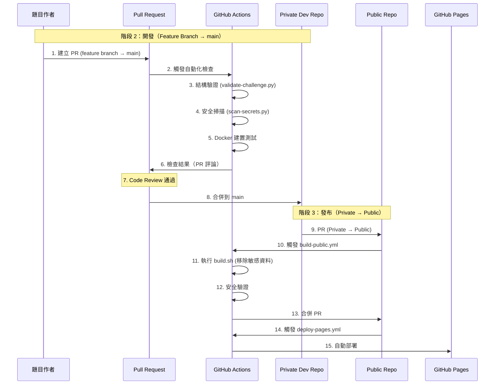

# IS1AB CTF Template 🚀

一個現代化的 CTF (Capture The Flag) 競賽管理模板，專為 IS1AB 團隊設計。

[](https://opensource.org/licenses/MIT)
[](https://www.python.org/downloads/)

## 📋 專案概述

這個專案提供了完整的 CTF 競賽管理解決方案，包含題目創建、管理、部署和評分系統。支援三階段開發流程：Template → Private → Public Repository。

### 🎯 一句話流程摘要

**Template Repo** → **Use Template 建立 Private Dev Repo** → **Feature Branches 開發題目** → **PR 審查合併到 main** → **比賽後自動發布到 Public Repo** → **GitHub Pages 自動部署**

> 💡 **詳細流程**：請參閱下方的 [三階段開發流程](#-三階段開發流程)

## ⚡ 快速開始（30 秒）

```bash
# 1. Clone 專案
git clone https://github.com/is1ab/is1ab-CTF-template.git
cd is1ab-CTF-template

# 2. 安裝依賴
curl -LsSf https://astral.sh/uv/install.sh | sh
uv sync

# 3. 創建第一個題目
uv run python scripts/create-challenge.py web hello_world baby --author "YourName"

# 4. 驗證題目
uv run python scripts/validate-challenge.py challenges/web/hello_world/

# 5. 啟動 Web 介面（可選）
cd web-interface && uv run python app.py
# 訪問 http://localhost:8004
```

> 📖 **詳細說明**：請參閱 [5 分鐘快速入門](docs/getting-started.md) 或 [完整文檔目錄](docs/README.md)

### 🎯 常用命令速查

| 操作             | 命令                                                                                       |
| ---------------- | ------------------------------------------------------------------------------------------ |
| **創建題目**     | `uv run python scripts/create-challenge.py <category> <name> <difficulty> --author "Name"` |
| **驗證題目**     | `uv run python scripts/validate-challenge.py challenges/<category>/<name>/`                |
| **安全掃描**     | `uv run python scripts/scan-secrets.py --path challenges/`                                 |
| **建置公開版本** | `./scripts/build.sh challenges/<category>/<name>/ public-release`                          |
| **啟動 Web GUI** | `cd web-interface && uv run python app.py`                                                 |
| **查看幫助**     | `uv run python scripts/create-challenge.py --help`                                         |

> 💡 **提示**：更多命令請參閱 [快速參考指南](docs/quick-reference.md)

## 🏗️ 專案結構

```text
is1ab-CTF-template/
├── web-interface/          # 主要的 Web 管理介面
│   ├── app.py             # Flask 應用程式
│   ├── templates/         # Jinja2 模板
│   │   ├── settings.html  # 設定頁面（含題目配額顯示）
│   │   └── ...
│   ├── static/           # 靜態資源 (CSS, JS)
│   ├── .venv/            # uv 虛擬環境
│   ├── legacy/           # 舊版本文件（參考用）
│   └── pyproject.toml    # Python 專案配置
├── challenges/           # CTF 題目目錄
├── docs/                # 專案文檔
├── scripts/             # 輔助腳本
│   ├── create-challenge.py    # 題目創建腳本
│   ├── validate-challenge.py  # 題目驗證腳本
│   ├── update-readme.py       # README 更新腳本
│   ├── build.sh               # 🔨 核心建置腳本（自動移除 flag）
│   ├── scan-secrets.py        # 🔒 安全掃描器
│   └── generate-pages.py      # 🌐 GitHub Pages 生成器
├── challenge-template/  # 題目模板結構（新增）
│   ├── private.yml.template   # 🔒 敏感資料模板
│   ├── public.yml.template    # 📢 公開資訊模板
│   └── ...
├── .github/workflows/   # GitHub Actions
│   ├── security-scan.yml      # 🔒 安全掃描 CI
│   ├── build-public.yml       # 🏗️ 建置公開版本 CI
│   └── deploy-pages.yml       # 🌐 Pages 部署 CI
├── config.yml          # 主要配置檔案（含題目配額設定）
└── archive/            # 舊版本檔案封存
```

## 🎯 三階段開發流程

> 💡 **快速導覽**：[階段 1：Template](#階段-1template-repository-模板階段) | [階段 2：Private](#階段-2private-challenge-repository-開發階段) | [階段 3：Public](#階段-3public-repository-發布階段)

### 📊 完整流程圖



**關鍵點**：

- ⚠️ **階段 1 → 2**：Use Template，不需要 PR
- ⚠️ **階段 2 開發**：Feature Branches，PR 到 Private Dev Repo 的 main（用於 Code Review）
- ⭐ **階段 2 → 3**：PR 到 Public Repo，唯一使用 PR 的地方（用於安全檢查和發布審核）

---

### 階段 1：Template Repository (模板階段)

```text
┌─────────────────┐
│  Template Repo  │ ← 您現在在這裡
│   (is1ab-org)   │
│     Public      │
└─────────────────┘
```

**說明**：公共模板倉庫，提供標準化的題目結構和工具腳本。

---

### 階段 2：Private Challenge Repository (開發階段)

```text
┌─────────────────┐  Use Template  ┌──────────────────────────┐
│  Template Repo  │───────────────▶│ Private Dev Repo (org)   │
│   (is1ab-org)   │                │   (is1ab-org, private)   │
│     Public      │                └──────────────────────────┘
└─────────────────┘                          │
                                              │ Feature Branches
                                              │ (per challenge)
                                              ▼
                                   ┌──────────────────────────┐
                                   │ challenge/web/sql-inj    │
                                   │ challenge/pwn/buffer     │
                                   │ challenge/crypto/rsa     │
                                   └──────────────────────────┘
                                              │
                                              │ PR + Review
                                              ▼
                                   ┌──────────────────────────┐
                                   │   main (of dev repo)      │
                                   │   (tested & validated)    │
                                   └──────────────────────────┘
```

**說明**：

- 使用 Template 建立 **Private Dev Repo**（在 is1ab-org 內）
- 題目作者被加入 is1ab-org，獲得 Write 權限
- 每個題目建立 **Feature Branch**（如 `challenge/web/sql-injection`）
- 開發完成後提交 **PR 到 Private Dev Repo 的 main**
- ⚠️ **不需要個人 Fork**，直接在 org repo 的 feature branch 開發
- PR 用於 Code Review 和自動化驗證（結構檢查、安全掃描、Docker 測試）

---

### 階段 3：Public Repository (發布階段)

```text
┌─────────────────┐     PR +      ┌─────────────────┐
│ Challenge Repo   │   Code Review │  Public Repo    │
│   (is1ab-org)   │──────────────▶│   (is1ab-org)   │
│     Private     │   + Security  │     Public      │
└─────────────────┘     Check     └─────────────────┘
                                            │
                                            │ 自動部署
                                            ▼
                                   ┌─────────────────┐
                                   │  GitHub Pages   │
                                   │   靜態網站展示    │
                                   └─────────────────┘
```

**說明**：

- ⭐ **這裡使用 PR 是正確且必要的**
- PR 用於 Code Review 和安全檢查
- GitHub Actions 自動執行：
  - ✅ 結構驗證（validate-challenge.py）
  - ✅ 安全掃描（scan-secrets.py）
  - ✅ Docker 建置測試
  - ✅ 敏感資料過濾（build.sh）
- 自動生成並部署 GitHub Pages
- 確保公開內容經過審核，不會洩漏題目

### 🔄 自動化 CI/CD 流程



> 📖 **詳細說明**：請參閱 [角色與權限管理](docs/roles-and-permissions.md) 了解完整的權限分配和工作流程

## 🎯 我是新手，從哪裡開始？

### 第一次使用？

1. **[5 分鐘快速入門](docs/getting-started.md)** ⭐ **必讀**

   - 完全新手專用
   - 最簡單的步驟說明
   - 5 分鐘內完成第一個題目

2. **[Git 操作教學](docs/git-workflow-guide.md)** 🔄

   - 學習 Git 和 GitHub 基本操作
   - 包含建立 repo、fork、push、commit 等完整流程

3. **[快速開始指南](docs/quick-start-guide.md)** ⚡
   - 15 分鐘完整教學
   - 包含 Docker 測試和 Web GUI 使用

### 想要深入了解？

- **[安全流程完整指南](docs/security-workflow-guide.md)** 🔒 - 完整的安全流程說明
- **[完整文檔目錄](docs/README.md)** 📚 - 所有文檔的索引和導航

---

## 🚀 快速開始

> 💡 **新手？** 建議先閱讀 [5 分鐘快速入門](docs/getting-started.md)

### 前置檢查

```bash
# 檢查是否已安裝必要工具
git --version      # 需要 Git 2.x+（如果沒有：https://git-scm.com/downloads）
python3 --version # 需要 Python 3.8+（如果沒有：https://www.python.org/downloads/）
uv --version      # 需要 uv（如果沒有會自動安裝）
```

### 1. 環境準備

#### 安裝 uv（Python 包管理器）

```bash
# macOS / Linux
curl -LsSf https://astral.sh/uv/install.sh | sh

# Windows (PowerShell)
powershell -c "irm https://astral.sh/uv/install.ps1 | iex"

# 驗證安裝
uv --version
```

> 📖 **詳細說明**：請參閱 [uv 環境設定](docs/uv-setup-guide.md)

### 2. 取得專案

#### 方法 A：使用 GitHub Template（推薦）

1. 前往 [GitHub Template](https://github.com/is1ab/is1ab-CTF-template)
2. 點擊 "Use this template" → "Create a new repository"
3. 設定 Repository 名稱和權限（建議 Private）
4. Clone 到本地：

```bash
git clone https://github.com/YOUR-USERNAME/your-repo-name.git
cd your-repo-name
```

#### 方法 B：直接 Clone

```bash
git clone https://github.com/is1ab/is1ab-CTF-template.git
cd is1ab-CTF-template
```

### 3. 設置專案

```bash
# 切換到 main 分支
git checkout main

# 安裝依賴（自動建立虛擬環境）
uv sync

# 驗證安裝
uv run python scripts/create-challenge.py --help
# 應該顯示幫助訊息
```

### 4. 建立第一個題目

```bash
# 建立簡單的 Web 題目
uv run python scripts/create-challenge.py web hello_world baby --author "YourName"

# 查看建立的題目
ls challenges/web/hello_world/
```

> 📖 **詳細說明**：請參閱 [題目創建指南](docs/challenge-creation-guide.md)

### 5. 啟動 Web 介面（可選）

```bash
cd web-interface
uv run python app.py
```

打開瀏覽器訪問：<http://localhost:8004>

> 📖 **詳細說明**：請參閱 [Web GUI 整合說明](docs/web-gui-integration.md)

## 📖 完整操作步驟

### �️ 組織管理員：建立開發環境

#### 1. 創建 Private Repository

```bash
# 步驟 1：在 GitHub 上使用此 Template 創建私有 Repository
# Repository name: 2024-is1ab-CTF
# Visibility: Private
# Include all branches: ✅

# 步驟 2：設置 Repository 權限
# Settings → Manage access
# - Admin: 核心團隊 (3-5人)
# - Write: 題目開發者 (10-20人)
# - Read: 審查者

# 步驟 3：設置分支保護
# Settings → Branches → Add protection rule
# Branch: main
# ✅ Require pull request reviews (至少1人)
# ✅ Require status checks to pass
# ✅ Include administrators
```

#### 2. 初始化配置

```bash
# Clone 私有 Repository
git clone https://github.com/your-org/2024-is1ab-CTF.git
cd 2024-is1ab-CTF

# 切換到 main 分支
git checkout main

# 安裝依賴
uv sync

# 編輯配置文件
cp config.yml.example config.yml
# 編輯 config.yml 設定專案資訊、平台配置、題目配額等
```

### 👤 題目開發者：Feature Branch 開發流程

#### 1. 取得 Repository 存取權限

**前提條件**：

- ✅ 組織管理員已將您加入 Private Dev Repository
- ✅ 您擁有 **Write** 權限

**⚠️ 重要**：不需要 Fork！直接在組織 Repository 中使用 Feature Branch 開發

```bash
# Clone 組織的 Private Repository
git clone https://github.com/your-org/2024-is1ab-CTF.git
cd 2024-is1ab-CTF

# 確認您在 main 分支並同步最新代碼
git checkout main
git pull origin main
```

> 💡 **提示**：詳細的 Git 工作流程請參閱 [Git Flow 標準化指南](docs/git-flow-standard.md)

#### 2. 創建題目

```bash
# 方法 1：使用命令列創建題目
uv run python scripts/create-challenge.py web my_sql_injection middle --author YourName

# 方法 2：使用 Web 介面創建
cd web-interface
uv run python app.py
# 訪問 http://localhost:8004 → 點擊「創建題目」
```

#### 3. 開發題目內容

```bash
# 創建題目會自動建立分支：challenge/web/my_sql_injection
# 編輯題目檔案：
# - challenges/web/my_sql_injection/public.yml: 基本資訊
# - challenges/web/my_sql_injection/src/: 題目源碼
# - challenges/web/my_sql_injection/docker/: 容器配置
# - challenges/web/my_sql_injection/writeup/: 官方解答
# - challenges/web/my_sql_injection/files/: 提供給參賽者的檔案
```

#### 4. 本地測試

```bash
# 進入題目目錄測試
cd challenges/web/my_sql_injection/docker/
docker-compose up -d

# 測試題目功能
curl http://localhost:8080  # 根據題目配置調整
# 驗證解題流程

# 清理測試環境
docker-compose down
```

#### 5. 驗證題目

```bash
# 使用驗證腳本檢查題目結構和配置
uv run python scripts/validate-challenge.py challenges/web/my_sql_injection/

# 檢查結果：
# ✅ 題目結構完整
# ✅ 配置檔案正確
# ✅ Docker 可成功建構
# ✅ Writeup 存在
```

#### 6. 提交 Pull Request

```bash
# 提交變更
git add challenges/web/my_sql_injection/
git commit -m "feat(web): add my_sql_injection - SQL injection basics

- 新增 SQL 注入基礎題目
- 難度：middle (200 points)
- 包含完整的 writeup 和測試環境
- Docker 部署支援"

git push origin challenge/web/my_sql_injection
```

#### 7. 在 GitHub 創建 PR

使用以下 PR 模板：

```markdown
## 📋 變更內容

- [x] 新增題目
- [ ] 修復問題
- [ ] 更新文檔

## �🎯 題目資訊

**題目名稱**: My SQL Injection
**分類**: Web
**難度**: middle  
**估計分數**: 200
**是否需要部署**: Yes

## 📝 變更說明

新增一個中等難度的 SQL 注入題目，適合初學者學習基本的注入技巧。

## ✅ 檢查清單

- [x] 本地測試通過
- [x] Docker 建構成功
- [x] 解題流程驗證
- [x] Writeup 已完成
- [x] 敏感資料檢查
- [x] 符合程式碼規範
```

### 🔍 審查者：PR 審查流程

#### 1. 程式碼審查

```bash
# Clone PR 分支進行本地測試
git fetch origin pull/123/head:pr-123
git checkout pr-123

# 檢查題目結構
tree challenges/web/my_sql_injection/

# 運行驗證
uv run python scripts/validate-challenge.py challenges/web/my_sql_injection/

# 測試 Docker 建構
cd challenges/web/my_sql_injection/docker/
docker-compose build
docker-compose up -d
# 進行功能測試
docker-compose down
```

#### 2. 安全檢查

```bash
# 檢查敏感資料
grep -r "password\|secret\|key" challenges/web/my_sql_injection/

# 檢查 flag 格式
grep -r "is1abCTF{" challenges/web/my_sql_injection/

# 檢查檔案權限
find challenges/web/my_sql_injection/ -type f -executable
```

#### 3. 審查清單

- [ ] 題目描述清楚且有趣
- [ ] 難度設定合理
- [ ] Docker 配置正確
- [ ] Writeup 詳細完整
- [ ] 無敏感資料洩露
- [ ] 符合團隊標準

### 🌍 比賽結束後：公開發布

#### 1. 創建 Public Repository

```bash
# 在 GitHub 創建公開 Repository
# Repository name: 2024-is1ab-CTF-public
# Visibility: Public

# 準備公開內容
uv run python scripts/prepare-public-release.py --event-date 2024-12-15

# 同步到公開 Repository
uv run python scripts/sync-to-public.py --target-repo your-org/2024-is1ab-CTF-public
```

#### 2. 設置 GitHub Pages

```bash
# 在公開 Repository 中啟用 GitHub Pages
# Settings → Pages
# Source: Deploy from a branch
# Branch: main / (root)
```

## ✅ 程式功能檢查清單

### 🔧 核心腳本功能

- ✅ **題目創建**: `create-challenge.py` - 支援 7 種分類、5 種難度、自動分支創建
- ✅ **題目驗證**: `validate-challenge.py` - 檢查結構完整性、配置規範、Docker 支援
- ✅ **批量驗證**: `validate-all-challenges.py` - 驗證所有題目、配額檢查、統計報告
- ✅ **進度更新**: `update-readme.py` - 自動更新專案進度和統計
- ✅ **儀表板生成**: `generate-dashboard.py` - HTML/JSON 格式的開發儀表板
- ✅ **公開發布**: `sync-to-public.py` - 自動同步到公開 Repository
- ✅ **專案初始化**: `init-project.py` - 設置專案基本配置

### 🌐 Web 介面功能

- ✅ **首頁儀表板**: 題目統計、進度追蹤、視覺化圖表
- ✅ **題目矩陣**: 按分類/難度顯示、配額進度、即時更新
- ✅ **題目管理**: 瀏覽、搜尋、驗證現有題目
- ✅ **創建題目**: 動態表單、即時驗證、自動生成結構
- ✅ **系統設定**: 配置管理、題目配額顯示、修改指導
- ✅ **API 介面**: RESTful API 支援統計和操作

### 🔒 安全和規範

- ✅ **配置驗證**: YAML 格式檢查、必填欄位驗證
- ✅ **結構檢查**: 題目目錄完整性、Docker 配置正確性
- ✅ **分支管理**: 自動創建功能分支、Git 工作流程支援
- ✅ **配額管理**: 基於 `config.yml` 的智能配額追蹤
- ✅ **多格式支援**: 靜態/動態附件、容器部署、網路挑戰

### 📊 進度追蹤功能

- ✅ **即時統計**: 總題目數、完成率、分類分布
- ✅ **配額檢查**: 分類配額 vs 實際數量、難度配額追蹤
- ✅ **視覺化**: 圓餅圖、進度條、統計卡片
- ✅ **報告生成**: HTML 儀表板、JSON 數據導出

### 🛠️ 開發者工具

- ✅ **命令列介面**: 所有腳本支援 `--help` 和參數說明
- ✅ **錯誤處理**: 詳細錯誤訊息、修復建議
- ✅ **擴展性**: 模組化設計、易於添加新功能
- ✅ **相容性**: uv 包管理、Python 3.8+ 支援

### 🧪 測試結果

本專案已通過以下測試：

```bash
# 測試題目創建
✅ uv run python scripts/create-challenge.py web test_challenge baby --author TestUser

# 測試題目驗證
✅ uv run python scripts/validate-challenge.py challenges/web/test_challenge/

# 測試批量驗證
✅ uv run python scripts/validate-all-challenges.py

# 測試 Web 介面
✅ cd web-interface && uv run python app.py

# 測試儀表板生成
✅ uv run python scripts/generate-dashboard.py

# 測試進度更新
✅ uv run python scripts/update-readme.py
```

所有核心功能已驗證可正常運作，滿足完整的 CTF 開發需求。

### 配額管理

系統基於 `config.yml` 自動追蹤題目配額：

```yaml
challenge_quota:
  by_category:
    web: 6 # Web 安全題目數量
    pwn: 6 # 二進制題目數量
  by_difficulty:
    baby: 8 # 入門題目數量
    easy: 10 # 簡單題目數量
```

### 批量操作

```bash
# 批量驗證所有題目
uv run python scripts/validate-all-challenges.py

# 更新 README 進度
uv run python scripts/update-readme.py

# 生成開發報告
uv run python scripts/generate-dashboard.py
```

## 🚨 故障排除

### 常見問題

#### 1. 模組找不到錯誤

```bash
# 錯誤: ModuleNotFoundError: No module named 'yaml'
# 解決: 確保使用 uv run
uv sync
uv run python scripts/create-challenge.py
```

#### 2. Web 介面無法啟動

```bash
# 錯誤: Port 8004 is in use
# 解決: 檢查端口或使用其他端口
cd web-interface
uv run python app.py --port 8005
```

#### 3. Git 分支問題

```bash
# 錯誤: branch already exists
# 解決: 手動切換或刪除分支
git checkout existing-branch
# 或
git branch -D challenge/category/name
```

#### 4. Docker 建構失敗

```bash
# 檢查 Docker 服務是否運行
docker --version
docker-compose --version

# 清理 Docker 快取
docker system prune -f
```

#### 5. 權限問題

```bash
# 錯誤: Permission denied
# 解決: 檢查文件權限
chmod +x scripts/*.py
```

### 環境要求

- **Python**: 3.8 或更高版本
- **uv**: 最新版本 (`curl -LsSf https://astral.sh/uv/install.sh | sh`)
- **Git**: 2.x 版本
- **Docker**: 可選，用於測試容器題目
- **瀏覽器**: 現代瀏覽器支援 (Chrome, Firefox, Safari)

### 效能優化

```bash
# 清理虛擬環境
rm -rf .venv && uv sync

# 重建 Web 資源
cd web-interface
rm -rf static/bundles/
uv run python app.py

# 清理 Git 歷史
git gc --prune=now
```

## 🎯 主要功能

### ✅ Web 管理介面

- 📊 **儀表板**: 題目統計和進度追蹤
- 📋 **題目矩陣**: 視覺化顯示已出題目和待出題目
- 🔧 **題目管理**: 瀏覽、搜尋、驗證題目
- ➕ **創建題目**: 動態表單協助創建新題目（✅ 已支援新安全流程）
- ⚙️ **系統設定**: 配置管理（含題目配額顯示）

> 📖 **注意**：Web GUI 已與新安全流程兼容，會自動創建 `private.yml` 和 `public.yml`。  
> 詳細說明請參閱 [Web GUI 整合指南](docs/web-gui-integration.md)

### 🎨 現代化設計

- **Bulma CSS 框架**: 現代響應式設計
- **題目配額系統**: 基於 `config.yml` 的進度追蹤
- **即時狀態顯示**: 已出題目 vs 未出題目視覺化
- **直觀操作介面**: 點擊、懸停、動畫效果

### 📱 響應式支援

- 桌面端優化體驗
- 平板裝置適配
- 手機端友善介面

### 🔧 命令列工具

- **題目創建**: `create-challenge.py` - 快速創建標準結構題目
- **題目驗證**: `validate-challenge.py` - 檢查題目完整性和規範
- **進度更新**: `update-readme.py` - 自動更新專案進度
- **批量操作**: 支援批量驗證和管理

### 🏗️ 三階段工作流程

1. **Template Stage**: 使用此模板創建初始項目
2. **Private Development**: 在私有 Repository 進行題目開發
3. **Public Release**: 比賽後自動發布到公開 Repository

### 🔒 安全特性

### 核心安全功能

- ✅ **分離式管理**：`private.yml`（含 flag）與 `public.yml`（公開資訊）完全分離
- ✅ **自動化建置**：`build.sh` 自動移除敏感資料並生成安全的公開版本
- ✅ **多層次掃描**：`scan-secrets.py` 掃描 flag、密碼、私鑰等敏感資料
- ✅ **CI/CD 整合**：GitHub Actions 自動執行安全掃描和建置流程
- ✅ **GitHub Pages**：自動生成並部署美觀的題目展示網站

### 安全檢查點

- 🔍 **PR 階段**：自動掃描 flag 格式、敏感檔案、Docker 配置
- 🔍 **建置階段**：二次驗證輸出無敏感資料洩漏
- 🔍 **部署階段**：部署前後安全驗證

📖 **詳細說明**：請參閱 [安全流程完整指南](docs/security-workflow-guide.md)

## 📖 詳細文檔

### 🎯 新手入門（從這裡開始！）

- **[5 分鐘快速入門](docs/getting-started.md)** ⭐ **完全新手必讀** - 最簡單的入門指南
- **[新手入門檢查清單](docs/getting-started-checklist.md)** ✅ - 確保您已完成所有設置步驟
- **[快速開始指南](docs/quick-start-guide.md)** - 15 分鐘完整教學，包含 Docker 測試
- **[Git 操作完整教學](docs/git-workflow-guide.md)** - 從零開始學習 Git 和 GitHub 操作，包含建立 repo、fork、push、commit 等
- **[完整文檔目錄](docs/README.md)** 📚 - 所有文檔的索引和導航

### 🔒 安全流程（核心功能）

- **[安全流程完整指南](docs/security-workflow-guide.md)** - 完整的安全流程說明，包含架構設計、使用說明、最佳實踐
- **[快速參考指南](docs/quick-reference.md)** - 常用命令和流程的快速參考
- **[Web GUI 整合說明](docs/web-gui-integration.md)** - Web 管理介面與安全流程的整合指南

### 📚 基礎文檔

- [安裝指南](docs/setup-guide.md) - 系統需求和初始設置
- [uv 環境設定](docs/uv-setup-guide.md) - uv 包管理器詳細說明
- [題目創建指南](docs/challenge-creation-guide.md) - 如何創建題目
- [題目開發指南](docs/challenge-development.md) - 題目開發最佳實踐
- [題目 Metadata 標準](docs/challenge-metadata-standard.md) - 標準化的題目配置格式
- [角色與權限管理](docs/roles-and-permissions.md) - 清晰的角色定義和權限分配
- [工作流程教學](docs/workflow-tutorial.md) - 三階段工作流程詳細說明
- [部署指南](docs/deployment-guide.md) - 部署到生產環境

### 🔍 快速查找

| 我想...      | 推薦文檔                                                            |
| ------------ | ------------------------------------------------------------------- |
| 快速開始     | [5 分鐘快速入門](docs/getting-started.md)                           |
| 學習 Git     | [Git 操作完整教學](docs/git-workflow-guide.md)                      |
| 了解安全流程 | [安全流程完整指南](docs/security-workflow-guide.md)                 |
| 查找命令     | [快速參考指南](docs/quick-reference.md)                             |
| 使用 Web GUI | [Web GUI 整合說明](docs/web-gui-integration.md)                     |
| 創建題目     | [題目創建指南](docs/challenge-creation-guide.md)                    |
| 角色權限     | [角色與權限管理](docs/roles-and-permissions.md)                     |
| 解決問題     | [常見問題 FAQ](docs/faq.md) ⭐                                      |
| 檢查進度     | [新手入門檢查清單](docs/getting-started-checklist.md) ✅            |
| 故障排除     | [安全流程指南 - 故障排除](docs/security-workflow-guide.md#故障排除) |

## 🛠️ 技術堆疊

### 後端

- **Flask 3.1.1** - Web 框架
- **PyYAML 6.0.2** - 配置解析
- **Flask-Assets 2.1.0** - 資源管理

### 前端

- **Bulma CSS 0.9.4** - CSS 框架
- **Font Awesome** - 圖標
- **標準 Jinja2** - 模板引擎

### 開發工具

- **uv** - Python 包管理
- **Flask Debug Mode** - 開發除錯

## 📋 配置系統

系統基於 `config.yml` 進行配置：

```yaml
# 題目配額配置
challenge_quota:
  by_category:
    web: 6 # Web 安全題目數量
    pwn: 6 # 二進制題目數量
    crypto: 4 # 密碼學題目數量
    # ...

  by_difficulty:
    baby: 8 # 入門題目數量
    easy: 10 # 簡單題目數量
    # ...
```

## 🎉 題目矩陣特色

- **進度追蹤**: 顯示 "已出題/配額總數"
- **視覺區分**: 已出題目 (綠框) vs 未出題目 (虛線黃框)
- **雙重檢視**: 按類別/按難度切換
- **即時更新**: 配額狀態即時計算

## 🤝 開發貢獻

我們歡迎所有形式的貢獻！請參閱：

- **[貢獻指南](CONTRIBUTING.md)** - 詳細的貢獻流程和規範
- **[行為準則](CODE_OF_CONDUCT.md)** - 社群行為標準
- **[常見問題](docs/faq.md)** - 遇到問題？先看看這裡

### 快速貢獻流程

1. Fork 這個專案
2. 創建您的功能分支 (`git checkout -b feature/AmazingFeature`)
3. 提交您的變更（遵循 [提交規範](CONTRIBUTING.md#提交規範)）
4. 推送到分支 (`git push origin feature/AmazingFeature`)
5. 開啟一個 [Pull Request](https://github.com/is1ab/is1ab-CTF-template/pulls)

## 📄 授權

本專案採用 MIT 授權條款 - 查看 [LICENSE](LICENSE) 檔案了解詳情。

## 📞 支援與回饋

如有問題或建議，請：

- 📖 查看 [常見問題 FAQ](docs/faq.md)
- 🐛 回報 [Bug](https://github.com/is1ab/is1ab-CTF-template/issues/new?template=bug_report.md)
- 💡 提出 [功能建議](https://github.com/is1ab/is1ab-CTF-template/issues/new?template=feature_request.md)
- 💬 參與 [討論](https://github.com/is1ab/is1ab-CTF-template/discussions)
- 📧 聯繫 IS1AB 團隊

---

**維護者**: IS1AB Team  
**最後更新**: 2025-01-XX  
**版本**: 2.1.0 (安全流程重構 + GitHub Pages 自動部署)

### 🆕 最新更新

- ✨ **安全流程重構**：完整的 Template → Private → Public 安全流程
- ✨ **自動化建置**：`build.sh` 自動移除敏感資料
- ✨ **安全掃描**：`scan-secrets.py` 多層次安全檢查
- ✨ **GitHub Pages**：自動生成並部署題目展示網站
- ✨ **CI/CD 整合**：GitHub Actions 自動化流程

📖 **詳細說明**：請參閱 [安全流程完整指南](docs/security-workflow-guide.md)
