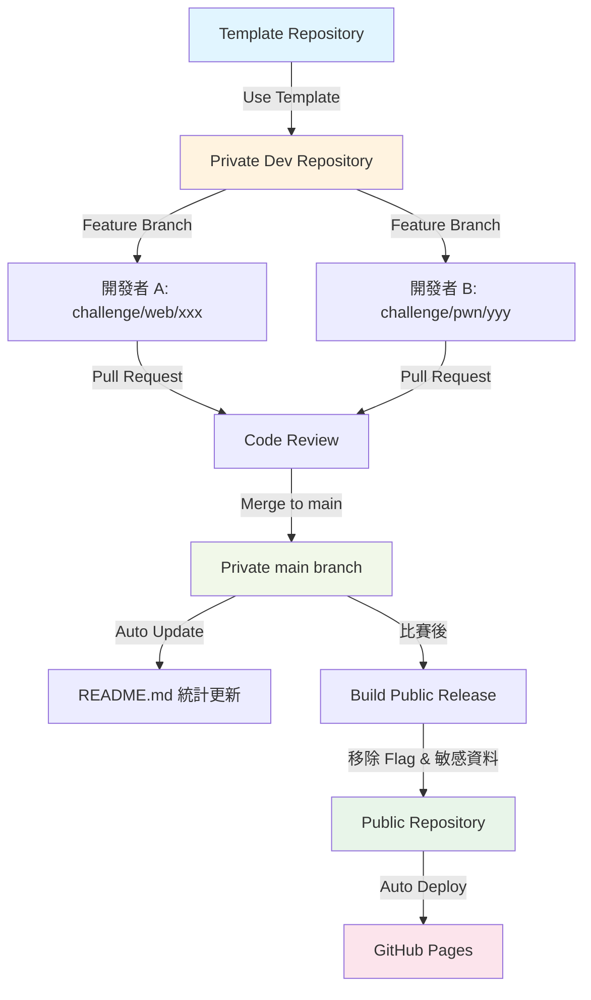

# 🏆 CTF 題目開發完整流程指南

> **從 Template 到 GitHub Pages 的完整自動化流程**

---

## 📋 目錄

- [流程概覽](#流程概覽)
- [階段 1: 初始化 Private Repository](#階段-1-初始化-private-repository)
- [階段 2: 團隊協作開發題目](#階段-2-團隊協作開發題目)
- [階段 3: 自動化整理與統計](#階段-3-自動化整理與統計)
- [階段 4: 發布到 Public Repository](#階段-4-發布到-public-repository)
- [階段 5: GitHub Pages 自動部署](#階段-5-github-pages-自動部署)
- [完整示例](#完整示例)

---

## 🎯 流程概覽



### 關鍵特性

- ✅ **自動化題目統整** - PR 合併時自動更新 README
- ✅ **安全保護機制** - 多層 Flag 洩漏檢測
- ✅ **自動移除敏感資料** - build.sh 自動清理
- ✅ **GitHub Pages 部署** - 自動生成題目展示網站
- ✅ **團隊協作** - Branch + PR + Code Review 流程

---

## 階段 1: 初始化 Private Repository

### 1.1 使用 Template 創建 Private Repo

#### 方式 A: GitHub 網頁操作

1. 訪問 Template Repository
   ```
   https://github.com/is1ab/is1ab-CTF-template
   ```

2. 點擊 **Use this template** → **Create a new repository**

3. 設置倉庫資訊：
   - **Owner**: 選擇組織或個人帳號
   - **Repository name**: `2025-is1ab-CTF` (範例)
   - **Visibility**: ⚠️ **Private** (重要！)
   - **Include all branches**: ❌ 不勾選

4. 點擊 **Create repository**

#### 方式 B: GitHub CLI

```bash
# 使用 gh CLI 創建
gh repo create is1ab/2025-is1ab-CTF \
  --template is1ab/is1ab-CTF-template \
  --private \
  --clone
```

### 1.2 Clone 並初始化

```bash
# Clone 到本地
git clone https://github.com/is1ab/2025-is1ab-CTF.git
cd 2025-is1ab-CTF

# 安裝依賴
curl -LsSf https://astral.sh/uv/install.sh | sh
uv sync

# 設置 Git Hooks（重要！）
./scripts/setup-hooks.sh

# 驗證設置
uv run python scripts/verify-setup.py
```

### 1.3 配置專案

#### 編輯 `config.yml`

```yaml
project:
  name: "is1ab-CTF"
  year: 2025
  organization: "is1ab"
  flag_prefix: "is1abCTF"  # Flag 格式: is1abCTF{...}

# 公開發布設定（比賽後使用）
public_release:
  repository:
    name: "is1ab/2025-is1ab-CTF-public"  # 設置公開 repo
    branch: "main"
  include:
    writeups: false  # 比賽期間設為 false，結束後改為 true
    docker_configs: true
    hints: true

# 團隊設定
team:
  default_author: "YourName"
  reviewers:
    - "admin"
    - "senior-dev"
```

#### 設置 CODEOWNERS

編輯 `.github/CODEOWNERS`，替換實際 GitHub 用戶名：

```
# 將 @admin 和 @senior-dev 替換為實際用戶名
*                           @actual-user1 @actual-user2
/challenges/web/**         @web-expert
/challenges/pwn/**         @pwn-expert
```

#### 設置 GitHub Secrets

前往 `Settings` → `Secrets and variables` → `Actions`，添加：

- **PUBLIC_REPO_TOKEN** (必須)
  - 用途: 推送到 public repository
  - 權限: `repo` + `workflow`
  - 生成: Settings → Developer settings → Personal access tokens

---

## 階段 2: 團隊協作開發題目

### 2.1 開發者工作流程

#### Step 1: 創建 Feature Branch

```bash
# 同步最新代碼
git checkout main
git pull origin main

# 創建題目分支（命名規範）
git checkout -b challenge/web/sql_injection

# 或者其他分類
git checkout -b challenge/pwn/buffer_overflow
git checkout -b challenge/crypto/rsa_attack
```

#### Step 2: 創建題目

```bash
# 使用腳本創建題目
uv run python scripts/create-challenge.py web sql_injection middle --author "YourName"

# 創建成功後會生成以下結構：
# challenges/web/sql_injection/
# ├── private.yml      # 🔒 包含 flag (不會被 git 追蹤)
# ├── public.yml       # 📢 公開資訊
# ├── README.md        # 題目說明
# ├── docker/          # Docker 環境
# ├── src/             # 源碼
# ├── files/           # 附件
# └── writeup/         # 解題說明
```

#### Step 3: 開發題目

**編輯 `private.yml`** (本地開發用，不會被 git 追蹤)：
```yaml
challenge:
  title: "SQL Injection Challenge"
  category: "web"
  difficulty: "middle"

# 🔒 敏感資訊（不會發布到 public）
flag:
  format: "static"
  value: "is1abCTF{sql_1nj3ct10n_m4st3r}"  # 實際 flag

# 內部筆記
internal_notes: |
  - 記得測試 SQLMap 是否能檢測
  - 檢查 WAF bypass 方法
```

**編輯 `public.yml`** (會發布到 public)：
```yaml
challenge:
  title: "SQL Injection Challenge"
  category: "web"
  difficulty: "middle"
  points: 200
  author: "YourName"

description: |
  這是一個 SQL Injection 挑戰，試著找出隱藏的 flag！

  連線資訊：http://challenge.ctf.is1ab.com:8001

# 提示（可選）
hints:
  - cost: 0
    content: "試試看 UNION SELECT"
  - cost: 50
    content: "資料庫是 MySQL"

# 附件
files:
  - "source.zip"

# 標籤
tags:
  - sql
  - web
  - database

# 題目類型
challenge_type: "static_container"
source_code_provided: true

# 狀態（用於進度追蹤）
status: "developing"  # planning, developing, testing, completed, deployed
ready_for_release: false  # 比賽時改為 true
```

**開發源碼和 Docker 環境**：

```bash
# 編輯源碼
cd challenges/web/sql_injection/src
vim app.py

# 編輯 Docker 配置
cd ../docker
vim Dockerfile
vim docker-compose.yml

# 測試 Docker 環境
docker-compose up -d
curl http://localhost:8001

# 停止測試環境
docker-compose down
```

**編寫 Writeup**：

```bash
cd ../writeup
vim README.md
```

#### Step 4: 測試和驗證

```bash
# 返回專案根目錄
cd ../../..

# 驗證題目配置
uv run python scripts/validate-challenge.py challenges/web/sql_injection/

# 安全掃描（確保沒有洩漏 flag）
uv run python scripts/scan-secrets.py --path challenges/web/sql_injection/

# 驗證通過後，更新狀態
# 編輯 public.yml，將 status 改為 "completed"
```

#### Step 5: Commit 和 Push

```bash
# 檢查變更（private.yml 不應該出現）
git status

# 添加文件（pre-commit hook 會檢查 flag 洩漏）
git add challenges/web/sql_injection/

# Commit（使用 Conventional Commits 格式）
git commit -m "feat(web): add SQL Injection challenge

- 實現基於 MySQL 的 SQL Injection 題目
- 提供源碼和 Docker 環境
- 完成 Writeup

Co-Authored-By: Claude Sonnet 4.5 <noreply@anthropic.com>"

# Push（pre-push hook 會再次檢查）
git push origin challenge/web/sql_injection
```

### 2.2 創建 Pull Request

#### 在 GitHub 創建 PR

1. 前往 GitHub Repository
2. 會看到 "Compare & pull request" 按鈕
3. 填寫 PR 資訊：

**標題範例**：
```
feat(web): Add SQL Injection Challenge
```

**PR 描述** (自動使用 PR Template)：

```markdown
## 📋 變更內容

- [x] 新增題目
- [ ] 修復問題
- [ ] 更新文檔

## 🎯 題目資訊

**題目名稱**: SQL Injection Challenge
**分類**: Web
**難度**: Middle
**估計分數**: 200
**是否需要部署**: Yes

## 📝 變更說明

新增基於 MySQL 的 SQL Injection 題目，包含：
- 完整的 Docker 環境
- 提供源碼
- 三個階段的提示
- 完整的 Writeup

## 🔍 測試情況

- [x] 本地測試通過
- [x] Docker 建構成功
- [x] 解題流程驗證
- [x] 文檔更新完成

## ✅ 檢查清單

### 題目相關
- [x] `public.yml` 格式正確
- [x] README.md 完整
- [x] Docker 檔案正確
- [x] Writeup 已完成
- [x] 提供檔案準備完成
- [x] Flag 格式正確: `is1abCTF{...}`

### 安全性
- [x] 無硬編碼密碼
- [x] 無真實 flag 洩露
- [x] Docker 安全配置
- [x] 檔案權限正確

## 🔍 審查者注意事項

請特別檢查 SQL Injection 是否可以被 SQLMap 直接跑出來。
```

4. 點擊 **Create pull request**

#### PR 自動檢查

PR 創建後，GitHub Actions 會自動執行：

1. **🔒 Security Scan** - 掃描 flag 洩漏和敏感資料
2. **📋 Validate Challenge** - 驗證題目配置
3. **🐳 Docker Build** - 測試 Docker 環境建構

等待所有檢查通過（綠色勾勾 ✅）。

### 2.3 Code Review

#### Reviewer 檢查項目

審查者需要檢查：

- [ ] 題目質量和難度適當
- [ ] Docker 環境可以正常運行
- [ ] Flag 格式正確且無洩漏
- [ ] Writeup 完整且正確
- [ ] 沒有敏感資料洩露
- [ ] 文檔清晰完整

#### 批准和合併

```bash
# Reviewer 批准後，可以合併
# 建議使用 "Squash and merge" 保持歷史整潔
```

### 2.4 合併後自動化

PR 合併到 `main` 後，自動觸發：

1. **📊 Update README** workflow
   - 自動收集所有題目資訊
   - 生成統計數據（總數、分類、難度分布）
   - 更新進度表格
   - 生成團隊任務分配
   - 自動 commit 更新的 README.md

2. **README.md 內容範例**：

```markdown
## 📊 題目進度追蹤

### 總體進度
- 📝 **規劃中**: 2 題
- 🔨 **開發中**: 3 題
- 🧪 **測試中**: 1 題
- ✅ **已完成**: 5 題
- 🚀 **已部署**: 5 題

### 詳細進度表
| 分類 | A | B | C | D | E | F |
|------|---|---|---|---|---|---|
| Web | ✅🐳 | ✅📎 | 🔨 | 📝 | ❌ | ❌ |
| Pwn | ✅🔌 | 🔨 | 📝 | ❌ | ❌ | ❌ |
| Crypto | ✅📎 | 🧪 | ❌ | ❌ | ❌ | ❌ |

**圖例**:
- ✅ 已完成 | 🔨 開發中 | 📝 規劃中 | ❌ 尚未開始
- 🔌 NC 題目 | 🐳 容器 | 📎 附件

### 個人任務分配
#### Alice
- **Web/SQL Injection**: completed (middle) ✅
- **Crypto/RSA**: developing (hard) 🔨

#### Bob
- **Pwn/Buffer Overflow**: completed (hard) ✅
- **Reverse/Crack Me**: testing (middle) 🧪
```

---

## 階段 3: 自動化整理與統計

### 3.1 README 自動更新機制

#### 觸發條件

```yaml
# .github/workflows/update-readme.yml
on:
  push:
    branches: [ main ]
    paths:
      - 'challenges/**'      # 題目目錄有變更
      - 'config.yml'         # 配置有變更
  pull_request:
    types: [ closed ]        # PR 合併時
    branches: [ main ]
```

#### 自動執行流程

1. **收集題目資訊** - 掃描所有 `public.yml`
2. **計算統計** - 分類、難度、狀態分布
3. **生成表格** - 進度追蹤表格
4. **更新 README** - 自動 commit 和 push

#### 手動觸發（如需要）

```bash
# 本地更新 README
uv run python scripts/update-readme.py

# 或者在 GitHub Actions 手動觸發
# Actions → Update README Progress → Run workflow
```

### 3.2 進度追蹤 JSON 匯出

```bash
# 匯出 JSON 格式的進度資料
uv run python scripts/update-readme.py --export-json

# 生成 progress.json
{
  "challenges": {
    "web": [...],
    "pwn": [...],
    ...
  },
  "stats": {
    "total_challenges": 15,
    "status_counts": {...},
    "difficulty_counts": {...}
  }
}
```

---

## 階段 4: 發布到 Public Repository

### 4.1 準備發布

#### 更新題目狀態

在比賽結束後，編輯各題目的 `public.yml`:

```yaml
status: "deployed"
ready_for_release: true  # 設為 true
```

#### 決定是否包含 Writeup

編輯 `config.yml`:

```yaml
public_release:
  include:
    writeups: true  # 比賽結束後設為 true
    docker_configs: true
    hints: true
```

### 4.2 執行建置

#### 方式 A: 自動觸發

```bash
# Push 變更到 main（如果有修改 challenges/**）
git add .
git commit -m "chore: prepare for public release"
git push origin main

# GitHub Actions 會自動執行 Build Public Release workflow
```

#### 方式 B: 手動觸發

1. 前往 GitHub Actions
2. 選擇 **Build Public Release** workflow
3. 點擊 **Run workflow**
4. 填寫參數：
   - **target_repo**: `is1ab/2025-is1ab-CTF-public`
   - **include_writeups**: `true` (比賽結束後)
   - **force_rebuild**: `true`
   - **dry_run**: `false`
5. 點擊 **Run workflow**

### 4.3 建置流程

**Build Public workflow 執行步驟**:

1. **📋 建置準備**
   - 檢查是否有 `ready_for_release: true` 的題目
   - 統計題目數量

2. **🔨 建置公開版本**
   - 執行 `scripts/build.sh`
   - 複製題目到 `public-release/`
   - **自動移除敏感資料**：
     - 刪除 `private.yml`
     - 刪除 `flag.txt`、`secrets.yml` 等
     - 從 YAML 中過濾敏感欄位 (flag, internal_notes...)
   - 生成建置報告

3. **🔒 安全驗證**
   - 執行 `scripts/scan-secrets.py`
   - 掃描 flag 格式 `is1abCTF{...}`
   - 檢查硬編碼密碼、API keys
   - 發現 HIGH 等級問題時失敗

4. **📤 推送到 Public Repo**
   - 使用 `PUBLIC_REPO_TOKEN`
   - 強制推送到目標倉庫
   - 創建 GitHub Release
   - 生成 Release Notes

5. **📢 通知**
   - GitHub Step Summary
   - Slack webhook（如已配置）

### 4.4 建置產物

```
public-release/
├── challenges/
│   ├── web/
│   │   └── sql_injection/
│   │       ├── public.yml        # 保留
│   │       ├── README.md         # 保留
│   │       ├── docker/           # 保留（如配置）
│   │       ├── files/            # 保留
│   │       ├── writeup/          # 保留（如配置）
│   │       └── src/              # 保留（如提供源碼）
│   ├── pwn/
│   └── crypto/
├── README.md
└── build-report.md
```

**移除的文件**:
- ❌ `private.yml` - 完全移除
- ❌ `flag.txt` - 完全移除
- ❌ `secrets.yml` - 完全移除
- ❌ `**/internal/` - 內部文檔

**過濾的 YAML 欄位**:
- ❌ `flag`
- ❌ `internal_notes`
- ❌ `deploy_secrets`
- ❌ `credentials`

---

## 階段 5: GitHub Pages 自動部署

### 5.1 啟用 GitHub Pages

#### 在 Public Repository 設置

1. 前往 Public Repository Settings
2. 選擇 **Pages**
3. Source 選擇 **GitHub Actions**
4. 保存設定

### 5.2 自動部署

#### 觸發條件

```yaml
# .github/workflows/deploy-pages.yml
on:
  push:
    branches: [ main ]
    paths:
      - 'public-release/**'  # public-release 有變更時
  workflow_dispatch:  # 或手動觸發
```

#### 部署流程

1. **🔨 建置網站**
   - 執行 `scripts/generate-pages.py`
   - 掃描 `public-release/` 目錄的所有題目
   - 生成靜態 HTML 網站：
     - 首頁 - 題目列表和統計
     - 分類頁 - 按分類瀏覽
     - 題目詳情頁 - 每個題目的完整資訊
     - 搜尋功能
   - 應用主題樣式（dark/light）

2. **🔒 安全檢查**
   - 掃描生成的 HTML 是否包含 flag
   - 檢查敏感資料洩漏

3. **🚀 部署到 GitHub Pages**
   - 上傳 `_site/` 目錄
   - 部署到 `https://<org>.github.io/<repo>/`

4. **✅ 部署後驗證**
   - 檢查網站 HTTP 狀態
   - 驗證內容無 flag 洩漏
   - 生成部署報告

### 5.3 網站功能

生成的 GitHub Pages 網站包含：

**首頁** (`index.html`):
```
📊 統計資訊
- 總題目數: 15
- Web: 6 題 | Pwn: 4 題 | Crypto: 3 題 | Misc: 2 題
- Baby: 5 | Easy: 6 | Middle: 3 | Hard: 1

🔍 搜尋和篩選
- 按分類篩選
- 按難度篩選
- 關鍵字搜尋

📋 題目列表
[卡片式展示所有題目]
```

**題目詳情頁**:
```
SQL Injection Challenge
🏷️ Web | ⭐⭐ Middle | 200 pts

📝 描述
[題目描述]

💡 提示
- 提示 1 (免費)
- 提示 2 (50 pts)

📎 附件
- source.zip (下載連結)

🔖 標籤
#sql #web #database

✍️ Writeup
[如果包含 writeup]
```

### 5.4 自訂主題

```bash
# 手動觸發部署並選擇主題
# Actions → Deploy GitHub Pages → Run workflow
# 選擇 theme: dark 或 light
```

---

## 完整示例

### 情境: 從零到 GitHub Pages 發布

#### Week 1-8: 開發階段

```bash
# === 組織管理員 ===
# 1. 使用 Template 創建 Private Repo
gh repo create is1ab/2025-is1ab-CTF \
  --template is1ab/is1ab-CTF-template \
  --private

# 2. 配置專案
vim config.yml  # 設置 flag_prefix, organization 等
git add config.yml
git commit -m "chore: configure project"
git push

# 3. 設置 GitHub Secrets
# Settings → Secrets → PUBLIC_REPO_TOKEN

# === 開發者 A ===
# 1. Clone 並初始化
git clone https://github.com/is1ab/2025-is1ab-CTF.git
cd 2025-is1ab-CTF
uv sync
./scripts/setup-hooks.sh

# 2. 開發題目
git checkout -b challenge/web/sql_injection
uv run python scripts/create-challenge.py web sql_injection middle --author "Alice"

# 3. 編輯題目
cd challenges/web/sql_injection
# 編輯 public.yml, src/, docker/ 等

# 4. 測試
cd docker && docker-compose up -d
# 測試解題流程
docker-compose down

# 5. 驗證
cd ../../../
uv run python scripts/validate-challenge.py challenges/web/sql_injection/

# 6. 提交 PR
git add challenges/web/sql_injection/
git commit -m "feat(web): add SQL Injection challenge"
git push origin challenge/web/sql_injection

# 7. 在 GitHub 創建 PR
# 等待 Code Review 和 CI/CD 檢查
# 合併 PR

# === 自動化執行 ===
# PR 合併後，自動觸發:
# - Update README workflow
# - README.md 自動更新統計資訊
```

#### Week 9: 比賽期間

```bash
# 題目繼續開發和測試
# README 持續自動更新進度
# 所有題目保持在 private repository
```

#### Week 10: 比賽結束，準備發布

```bash
# === 組織管理員 ===
# 1. 創建 Public Repository
gh repo create is1ab/2025-is1ab-CTF-public --public

# 2. 更新配置
vim config.yml
# 設置:
#   public_release.repository.name: "is1ab/2025-is1ab-CTF-public"
#   public_release.include.writeups: true

# 3. 更新題目狀態
# 批量更新所有題目的 public.yml
find challenges -name "public.yml" -exec sed -i '' 's/ready_for_release: false/ready_for_release: true/g' {} \;
find challenges -name "public.yml" -exec sed -i '' 's/status: deployed/status: deployed/g' {} \;

# 4. Commit 變更
git add .
git commit -m "chore: prepare for public release"
git push

# 5. 觸發 Public Release
# Actions → Build Public Release → Run workflow
# 填寫參數:
#   target_repo: is1ab/2025-is1ab-CTF-public
#   include_writeups: true
#   force_rebuild: true

# === 自動化執行 ===
# Build Public workflow:
# 1. 執行 build.sh 移除敏感資料
# 2. 安全掃描驗證
# 3. 推送到 is1ab/2025-is1ab-CTF-public
# 4. 創建 Release

# Deploy Pages workflow (在 Public Repo):
# 1. 生成靜態網站
# 2. 部署到 GitHub Pages
# 3. 網站上線: https://is1ab.github.io/2025-is1ab-CTF-public/
```

#### 訪問成果

```
📍 Public Repository: https://github.com/is1ab/2025-is1ab-CTF-public
📍 GitHub Pages: https://is1ab.github.io/2025-is1ab-CTF-public/
📍 Release: https://github.com/is1ab/2025-is1ab-CTF-public/releases/latest
```

---

## 🎯 關鍵要點

### ✅ 做什麼

1. **使用 Feature Branch** - 每個題目一個分支
2. **使用 PR 流程** - 強制 Code Review
3. **本地測試充分** - Docker 環境和解題流程
4. **遵循 Git Hooks** - 防止敏感資料洩漏
5. **更新題目狀態** - `status` 和 `ready_for_release`
6. **比賽後發布** - 使用自動化 workflow

### ❌ 不要做什麼

1. **不要直接推送到 main** - 使用 PR 流程
2. **不要提交 private.yml** - Git Hooks 會阻止
3. **不要在 public.yml 中寫 flag** - 會被自動掃描檢測
4. **不要跳過驗證** - validate-challenge.py 很重要
5. **不要手動移除 flag** - 使用 build.sh 自動化
6. **不要比賽期間發布到 public** - 等比賽結束

### 🔒 安全檢查點

| 階段 | 檢查機制 | 說明 |
|------|---------|------|
| **本地開發** | Git Hooks | pre-commit + pre-push 檢查 |
| **PR 創建** | GitHub Actions | Security Scan workflow |
| **PR 合併** | Branch Protection | 要求 Review + CI 通過 |
| **Public Build** | build.sh + scan-secrets | 移除敏感資料 + 掃描 |
| **Pages 部署** | deploy-pages | 部署前安全檢查 |

---

## 📚 相關文檔

- [Git Hooks 設置](../scripts/setup-hooks.sh)
- [安全工作流程指南](security-workflow-guide.md)
- [題目開發最佳實踐](challenge-development.md)
- [GitHub Secrets 設置](github-secrets-setup.md)
- [分支保護設置](branch-protection-setup.md)

---

**需要幫助？** 查看 [FAQ](FAQ.md) 或建立 Issue

**最後更新**: 2026-01-18
