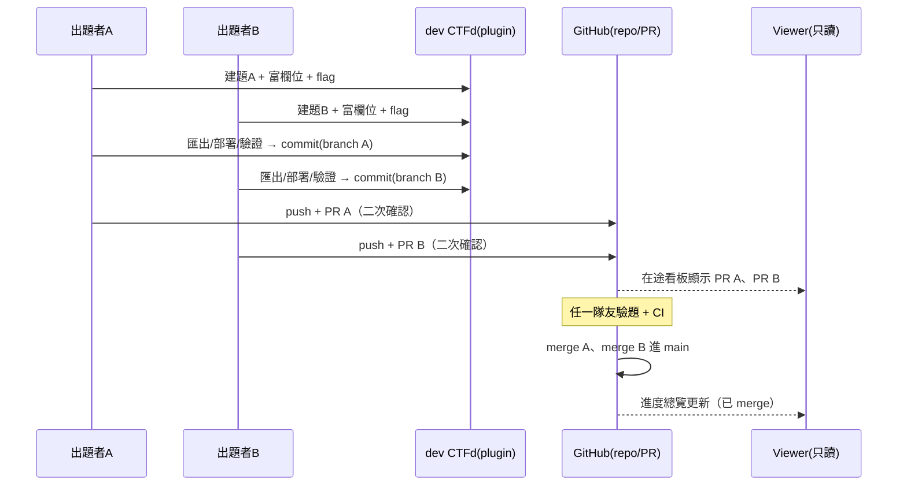

# Dev CTFd 出題系統 — 規格與架構

> 狀態：**實作中**。Phase 1-3 已完成（轉換器、dev 環境、合一出題表單）。
> 雙角色審查（PM＋出題者）發現的地基缺口與待定案，見 §13。

---

## 1. 目的與範圍

打造一個**內部出題開發系統**：出題者在一台 **dev CTFd** 上建立題目、快速匯出 YAML、部署測試、自動驗證 exploit，最後把成品送回 git repo 存檔。

- **這是開發工具**，服務對象是出題團隊本身。
- **正式比賽 CTFd 是另一台，明確排除在本規格之外**（見 §11）。
- 因為 dev CTFd 只有出題團隊會用，跟能看 `private.yml` 的是**同一群人、同一個信任邊界**，所以 flag / 官方解 / 測試帳密**放進 dev CTFd 沒有新的洩漏風險**。

---

## 2. 核心原則

1. **repo 是唯一真相（system of record）。** CTFd 是開發中樞 + runtime，永遠不是權威來源。所有東西最終都經 PR 回到 repo。
2. **CTFd 負責它擅長的事**：出題表單、玩家視角試玩、部署、驗證。
3. **code 本體活在 git。** `src/` `docker/` `solution/` `writeup/` 是可 diff、可 review 的原始碼樹，由 plugin 的 git 整合處理（見 §5.4），不塞成 CTFd 附件。
4. **維護策略**：CTFd 版本 **pin 住**，升版壞了再修。不為了「將來可能升版」而綁手綁腳。

---

## 3. 架構總覽

```
┌──────────────────────── dev CTFd（出題中樞）────────────────────────┐
│  CTFd 本體  +  is1ab_authoring plugin                               │
│  ├─ 原生欄位：name / category / description / value / tags / hints   │
│  ├─ 富欄位面板：官方解 / 內部筆記 / 測試帳密 / 學習目標 …（metadata blob）│
│  ├─ 附件上傳                                                        │
│  ├─ [匯出 YAML]  [部署測試]  [驗證 exploit]  三顆按鈕                 │
│  └─ git 整合：把題目寫進 branch、commit（half-auto）                  │
└───────────────────────────────┬────────────────────────────────────┘
                                 │ 匯出 + commit + (二次確認) push/PR
                                 ▼
┌──────────────────── git repo（唯一真相 / system of record）──────────┐
│  challenges/<cat>/<name>/{public.yml, private.yml, src/, docker/,    │
│                           solution/, writeup/, files/}              │
│  PR review · 秘密掃描 · exploit CI 驗證 · 歷史                       │
└───────────────────────────────┬────────────────────────────────────┘
                                 │ 讀 main + 開著的 PR（gh api）
                                 ▼
┌──────────────── 共用只讀 Viewer（全隊進度總覽，內網一台）─────────────┐
│  已 merge 的題 + 在途 PR（誰在出什麼、卡哪）                          │
└─────────────────────────────────────────────────────────────────────┘
```

三個器官各司其職，互不取代：

| 器官 | 職責 | 為什麼別人取代不了 |
|---|---|---|
| **git repo** | 真相、協作、review、歷史、code | CTFd 存不下可審的原始碼樹 |
| **dev CTFd + plugin** | 出題 UI、玩家視角試玩、部署、驗證 | repo/Viewer 給不了「玩家怎麼玩」 |
| **Viewer** | 共用只讀進度總覽 | 前兩者非為此設計；只讀＝無併發衝突 |

---

## 4. 核心開發迴圈與流程

```
① 在 dev CTFd 建題        →  原生欄位 + 富欄位面板 + 上傳附件
② 匯出 YAML               →  plugin 產 public.yml/private.yml + 題目目錄骨架
                             寫進 branch、commit（停在 commit）
③ 部署測試                →  起 docker compose，用玩家視角試玩
④ 驗證 exploit            →  跑官方解打部署好的實例，比對 flag
⑤ push + 開 PR（二次確認） →  review → merge → repo 存檔
```

- 只有 **code 本體**（`src/`/`docker/`）需要出題者在 repo/IDE 編輯（見 §10 決策 C）。其餘 metadata / flag / hints / 附件 全在 CTFd 完成。
- ②③④ 皆由 plugin 按鈕觸發；④ 直接重用現有 [`verify-solution.py`](../scripts/verify-solution.py) 與 CI「跑官方解 + 比對 flag」。

### 4.1 角色與權限

> 架構＝**一台共用 dev CTFd + 題目層級權限管控 plugin**（見 §9）。plugin 只做
> **題目擁有權 + 編輯 ACL + 驗題指派**，**不做**多租戶（不隱藏可見性、不做 per-user 沙盒）。
> 大家都看得到所有題的清單/狀態，只是**不能改不是自己的**。出題走 plugin 的出題介面（不走 CTFd 原生 admin UI，以便 ACL 生效）。

| 角色 | 在哪操作 | 主要動作 |
|---|---|---|
| **PM**（= CTFd admin） | dev CTFd(admin) + plugin 管理面 | 一次性設置、**配額規劃（數量×難度×分類）**、**指派出題者**、**指派驗題人**、看全部、管理擁有權與狀態 |
| **出題者** | plugin 出題面 + repo/IDE | 建/編**自己**的題、寫 code、匯出、部署測試、驗 exploit、開 PR |
| **驗題人** | plugin（被指派的題）+ GitHub | 被指派後負責該題：試玩、實際解、於 PR approve/request changes |
| **CI bot** | GitHub Actions | validate / secret-scan / docker-build / exploit 驗題 |
| **全隊** | 內網 Viewer（只讀） | 看進度：已 merge + 在途 PR + 指派狀態 |

### 4.2 Phase 0 — 一次性設置（admin，只做一次）

1. 用 dev docker-compose 起 CTFd（**pin 版本**）+ 掛 `is1ab_authoring` plugin
2. 給 plugin 一份 repo 的 working clone + git / gh 認證
3. 架共用只讀 Viewer（既有 Internal Viewer + 在途看板擴充）
4. 把 dev CTFd URL 發給每位出題者

### 4.3 Phase 1 — 出題者流程（每題重複）

1. 開 dev CTFd → 新增題目：原生欄位（名稱/分類/描述/分數/tags/hints）+ 富欄位面板（難度/類型/官方解/測試帳密/內部筆記/…）+ 上傳附件 + 設 flag
2. 在 repo/IDE 寫 code（`src/` / `docker/` / `solution/`）
3. 按 **【匯出 YAML】** → plugin 產 `public.yml`/`private.yml` + 目錄骨架，切到 `challenge/<cat>/<name>` branch、`commit`
4. **本機部署測試**（Ⓐ：code 在你自己 clone，不在 CTFd 容器）：`cd challenges/<path>/docker && docker compose up -d`，用玩家視角試玩
5. **本機驗 exploit**：`make verify-solution ARGS="challenges/<path>"` → 起服務→跑官方解→比對 flag（含 flag drift 偵測），**綠燈才算過**。指令在 CTFd 匯出頁會帶好 path 直接複製
6. **二次確認** 後 push + 開 PR → 進 review
7. CI 自動跑（validate / secret-scan / docker-build / exploit 驗題）

### 4.4 Phase 2 — 驗題流程（被指派的驗題人）

1. 出題者把題標記 `ready_for_review`；**PM 指派 reviewer**（plugin → `gh` 對 PR 發 review request）
2. 被指派者在 Viewer / GitHub 看到待驗 PR
3. 拉 branch → 起服務 → 實際解 → 比對 `private.yml` 的 flag
4. PR 上打勾「驗題人 checklist」→ **Approve** 或 **Request changes**
5. CI 綠 + **指派的** reviewer approve → **squash merge** 進 main（repo 存檔）

### 4.5 多人並行時序



各出題者在**自己的 branch** 上平行作業，天然隔離；Viewer 只讀匯總，不介入編輯，因此沒有併發衝突。

### 4.6 交棒賽站（out of scope，僅標示介面）

merged 到 main 的題目，就是正式賽站的輸入來源。repo → 賽站（staging/production）的部署是**另一條路、另一台機器**，不在本規格（見 §11）。

---

## 5. CTFd 插件設計（`is1ab_authoring`）

> 除了以下的出題功能，plugin 還負責 §9 的**題目層級權限管控 + 驗題指派**
> （擁有權 / 編輯 ACL / reviewer 指派 / 出題介面取代原生 admin 編輯）。

### 5.1 富欄位儲存 — 單一 metadata blob

**不**在 CTFd 加一堆 typed 欄位（要碰 React admin、升版易壞）。改為新增一個 plugin DB model，每題掛一塊 **template metadata blob**（YAML/JSON），把所有 CTFd 原生沒有的欄位塞進去：

```
ChallengeMetadata
  challenge_id : FK → CTFd challenges.id
  blob         : Text   # YAML/JSON，內含 §6 表中「來源＝plugin metadata blob」的欄位
```

好處：plugin 面積最小、最耐 CTFd 升版、匯出器好讀。

### 5.2 出題表單（admin UI）

plugin 註冊一個 admin 頁面 / 面板（Flask blueprint + 模板），提供富欄位表單：
`author / difficulty / challenge_type / owners / assignee / status / ready_for_release /
learning_objectives / required_skills / recommended_tools / references / deploy_info /
官方解 solution_steps / internal_notes / test_credentials / test_cases / …`

### 5.3 三顆按鈕（plugin API endpoints）

| 按鈕 | 動作 |
|---|---|
| **匯出 YAML** | 讀原生欄位 + metadata blob → 產 `public.yml`/`private.yml` + 目錄骨架 → 寫進 branch → `git add/commit` |
| **部署測試** | 對題目的 `docker/` 跑 `docker compose up -d`；回傳連線資訊 |
| **驗證 exploit** | 跑 `verify-solution.py` 打部署好的實例，比對 flag，回傳 pass/fail |

### 5.4 git 整合

- plugin 在 CTFd host 上持有一份 **repo 的 working clone**（+ 需要的 git / gh 認證）。
- 「匯出 YAML」把題目寫進 `challenges/<cat>/<name>/`，開/切到 `challenge/<cat>/<name>` branch，`commit`。
- **half-auto**：預設**停在 commit**。`push` + `gh pr create` 需**二次確認**才執行（對遠端的不可逆動作不自動做）。

### 5.5 版本策略

dev docker-compose **pin 住 CTFd 版本**（見 §10 決策 A）。升版導致 plugin 壞掉時再修，不預先為升版讓步。

---

## 6. 資料模型 / 欄位對映（CTFd ↔ YAML）

| YAML 欄位 | 檔案 | 來源 |
|---|---|---|
| `title` | public | CTFd `name` |
| `category` | public | CTFd `category` |
| `description` | public | CTFd `description` |
| `points` | public | CTFd `value` |
| `tags` | public | CTFd tags |
| `hints[].content` / `.cost` | public | CTFd hints（`level` 由順序推） |
| `files` | public | CTFd 附件 |
| `flag` | **private** | CTFd `flags[0].content` |
| `flag_type` | **private** | CTFd `flags[0].type`（static/regex；dynamic 特例不建靜態 flag） |
| `author` `difficulty` `challenge_type` `owners` `assignee` `status` `ready_for_release` `learning_objectives` `required_skills` `recommended_tools` `references` `deploy_info` `metadata` | public | plugin metadata blob（**非敏感**部分） |
| `flag_description` `dynamic_flag` `solution_steps` `test_credentials` `internal_notes` `test_cases` `verified_solutions` `deploy_secrets` `last_tested` `tested_by` `test_result` | **private** | plugin metadata blob（**敏感**部分） |

**敏感 / 非敏感的界線**由 [`private.yml.template`](../challenge-template/private.yml.template) 底部那份「永遠不出現在 public.yml」清單定義。轉換器據此把 blob 拆進 public / private。未知欄位一律 fail-safe 進 private。

---

## 7. 要建的組件

| # | 組件 | 說明 | 現況 |
|---|---|---|---|
| 1 | **轉換模組**（純函式，可測） | CTFd 資料 + blob ⇄ `public.yml`/`private.yml`。plugin 與 CLI 共用 | ❌ 新建 |
| 2 | **CTFd 插件** `is1ab_authoring` | metadata model + 出題表單 + 三顆按鈕 API + git 整合 | ❌ 新建 |
| 3 | **權限管控 + 驗題指派** | ChallengeACL model + 編輯 ACL + reviewer 指派 + gh review request（§9） | ❌ 新建 |
| 4 | **dev 開發環境** | docker-compose：CTFd(pin) + 掛 plugin + 掛 repo | ❌ 新建 |
| 5 | **部署測試** | 一鍵 `docker compose up/down` | 🟡 有 docker 骨架，補觸發 |
| 6 | **exploit 驗證** | 接 `verify-solution.py` + 保留 CI | ✅ 已有，接線 |
| 7 | **git 半自動** | branch/add/commit（server 端 worktree）；push/PR 二次確認 | ❌ 新建 |
| 8 | **Viewer 在途看板** | 用 `gh api` 撈開著的 PR + 指派狀態，補進現有 Viewer | 🟡 Viewer 已有，擴充 |

保留不動：富欄位 schema、PR review、秘密掃描、賽後 public 站、exploit CI。

---

## 8. 施作階段

1. **Phase 1 — 轉換模組 + 單元測試**（版本無關，可立即做、可驗）
2. **Phase 2 — dev 環境**（docker-compose CTFd pin + plugin skeleton 能 load）
3. **Phase 3 — plugin metadata model + 出題表單**
4. **Phase 4 — 匯出 YAML + git commit**（server 端 worktree）
5. **Phase 5 — 部署測試 + exploit 驗證**（Ⓐ：本機 `make verify-solution`；plugin 匯出頁帶好指令。verify-solution 已強化：種真 flag 進 .env、等 container healthy）
6. **Phase 6 — 權限管控** ✅ 已實作：出題路由 `@authed_only`；編輯 ACL = owner + collaborators + admin（其他人 403）；只有 owner/admin 能改協作者清單（防提權）。出題走 plugin 介面而非原生 admin。
7. **Phase 7 — PM 分配與指派** ✅ 已實作：配額頁（目標 vs 實際對帳）+ 工單（指派出題者/驗題者、狀態、連結題目）。受控詞彙下拉（category/difficulty）杜絕對帳誤差。
   *（指派 reviewer 時 best-effort 發 `gh` review request：設了 `GITHUB_REPO`/`GITHUB_TOKEN` 且該題有對應 open PR 才發；假設 CTFd `user.name` == GitHub username。無則安靜略過。本環境無真實 repo 未實測，程式路徑已就緒。）*
8. **Phase 8 — 前台儀表板** ✅ 已實作：儀表板（配額對帳 + 工單 + 在途 PR，登入才可見）+「我的題目/指派給我」頁（含「尚未建題」標記）。在途 PR 靠 GitHub API（env `GITHUB_REPO`/`GITHUB_TOKEN`，未設定則優雅降級）。
   *（Ⓐ 下 git push/PR 由出題者本機做，不在 plugin）*

每個 phase 獨立可驗，做完一個再往下。

---

## 9. 多人協作、權限管控與驗題指派

架構：**一台共用 dev CTFd + 題目層級權限管控 plugin**。只管控「誰能改、誰驗」，
**不做**多租戶隔離（不隱藏可見性、不做 per-user 沙盒）。

### 9.1 資料模型

```
ChallengeACL
  challenge_id   : FK
  owner_id       : 出題者
  collaborators  : [user_id]   # 可共同編輯
  reviewers      : [user_id]   # 被指派的驗題人
  review_status  : draft | ready_for_review | in_review | approved | changes_requested
```

### 9.2 權限規則

| 動作 | 誰可以 |
|---|---|
| 看清單 / 狀態 | **全員**（不隱藏，利於協調） |
| 編輯某題 | 該題 `owner` + `collaborators` |
| 指派驗題人 | `PM` |
| 驗某題 | 被指派的 `reviewers` |
| 核准 | 記錄在 **GitHub PR**（repo 為準，不在 plugin 裡定生死） |

> 出題者**不是 CTFd admin**，出題一律走 plugin 出題介面 → ACL 才擋得住。
> CTFd 原生 admin 保留給 **PM**。

### 9.3 驗題指派流程

1. 出題者匯出 + 開 PR，把題標記 `ready_for_review`
2. **PM 在 plugin 指派 reviewer**（可多人）
3. plugin 用 `gh api` 對該 PR 發出 review request（GitHub 側同步）
4. reviewer 試玩 + 跑驗證 → 在 **PR** 上 approve / request changes
5. CI 綠 + 指派的 reviewer approve → merge

### 9.4 共享總覽（進度追蹤）

進度追蹤直接**做進共用 dev CTFd 的前台**（把原本的參賽者頁改用途），而非另架靜態 Viewer：

- **全站登入才可見**：`challenge_visibility` / `account_visibility` / `score_visibility` /
  `registration_visibility` 皆設 `private`，匿名一律導去 `/login`。
- **參賽者頁改用途**：Scoreboard/Users 這類參賽者導覽改成「開發進度追蹤」（誰在出什麼、狀態、quota）。
- **保留 Challenges**：留玩家視角供「試玩」。
- **出題 UI 不藏**：掛進前台主導覽（`register_user_page_menu_bar`）+ admin 選單。
- **常用設定前置**：把常用的 admin 設定捷徑搬到前台，改設定更順手。

> 既有的靜態 Internal Viewer（[wiki/Viewer-Deployment.md](../wiki/Viewer-Deployment.md)）變成**可選**——
> 需要「不進 CTFd、完全匿名的公開總覽」時才用；日常團隊追蹤走上面 CTFd 前台即可。

### 9.5 併發

題目各在自己的 `challenge/<cat>/<name>` branch；server 端每題一個 `git worktree` 供 plugin commit，避免多人匯出互搶同一 working tree。

### 9.6 PM 分配與指派

PM 負責整場的**題目規劃**，不只指派驗題：

```
ChallengeQuota                     # 配額目標
  category    : web/pwn/...
  difficulty  : baby/easy/...
  target      : 目標題數

Assignment                         # 出題工單（可先於題目存在）
  id
  category, difficulty             # 這個 slot 要出什麼
  author_id                        # 指派給誰出
  reviewer_ids : [user_id]         # 指派給誰驗
  challenge_id : 題目建立後回填（nullable）
  status       : unassigned | assigned | in_progress | in_review | done
```

PM 管理頁：
1. **設配額** — 各 category×difficulty 目標題數
2. **指派出題者** — 建工單、指定 author（工單可先開，author 之後把題填進去）
3. **指派驗題人** — 指定 reviewer（→ §9.3 gh review request）
4. **看進度 vs 配額** — 首頁儀表板（§12.1）依 quota 與 assignment 算完成度

---

## 10. 決策

### 已定案（本輪對話拍板）

- **架構**：一台共用 dev CTFd + 題目層級權限管控 plugin（非多租戶）
- **隔離**：只管控「誰能改 / 誰驗」，不隱藏可見性、不做 per-user 沙盒
- **驗題**：**指派制**（PM 指派 reviewer），取代原 template 的「誰有空誰驗」
- **CTFd 目標**：dev CTFd 一台；正式賽站排除（§11）
- **git 自動化**：半自動到 commit，push/PR 二次確認

### 已裁定（採建議）

| | 決策 | 定案 |
|---|---|---|
| **A** | CTFd 版本 | pin **`ctfd/ctfd:3.7.5`**（compose 內單一常數，之後可換） |
| **B** | plugin 位置 | 本 repo 新資料夾 **`ctfd-plugin/`** |
| **C** | code 編輯 | 在 **repo/IDE** 編輯；plugin 只負責 metadata + commit，不做瀏覽器 code editor |
| **D** | 誰能指派 reviewer | 專責 **PM** |
| **E** | 容器怎麼跑 | 純 **`docker compose`** |

---

## 11. 明確排除（out of scope）

- **正式比賽 CTFd 的部署**（staging/production 賽站）。那是另一條路、另一台機器；repo→賽站的推送由既有機制處理，不在本規格。
- 把敏感欄位同步到**正式賽** CTFd（永遠不做）。
- 在 CTFd 內建一個完整瀏覽器 code editor。

---

## 12. 頁面規劃（IA，出題導向）

原則：**一切以出題為主、多餘的砍掉、前台全站登入才可見**（§9.4）。

### 12.1 前台（登入才可見）

| 頁面 | 用途 | 決定 |
|---|---|---|
| **首頁 `/`（儀表板）** | 開發進度總覽：quota / 誰在出什麼 / 狀態 / 在途 PR / 指派 | **新建**，取代預設首頁 |
| **出題 `/admin/is1ab`** | 建題／編題（原生 + 富欄位）+ 清單 | 已有雛形（Phase 3）；Phase 4 併原生欄位 |
| **我的題目 `/is1ab/mine`** | 個人視角：我出的 + 指派給我驗的 | **新建** |
| **Challenges `/challenges`** | 玩家視角試玩 | **保留** |
| 設定捷徑 | 常用 admin 設定前置到主導覽 | nav 連結 |
| `/user` `/settings` `/logout` | 個人帳號 | 保留（內建） |

### 12.2 移除 / 改用途

| 頁面 | 決定 | 做法 |
|---|---|---|
| **Scoreboard `/scoreboard`** | **移除** — 進度改到首頁儀表板 | nav 不連 + route 導回 `/` |
| **Users `/users`（參賽者）** | **移除或改「團隊/擁有權」** | nav 不連 / 重用 |
| Teams | 不用（user 模式） | — |
| 公開 Register | 關閉 | `registration_visibility=private`（已設 ✅） |
| `/notifications` | 視需要保留 | 內建 |

> 移除內建 nav 的做法：主要靠 `override_template` 覆蓋主題 navbar（把不要的連結拿掉），
> 搭配 route 導回首頁。**不刪 CTFd 原始碼**（升版才不會衝突）。

### 12.3 Admin（PM 專用，保留）

`/admin/challenges`（建原生欄位）、`/admin/config`、`/admin/plugins`（is1ab 出題）、
`/admin/users`（帳號 / 角色 / 指派）、`/admin/submissions`、`/admin/notifications`、`/admin/statistics`。

### 12.4 待定：出題表單「合一」還是「分離」

| | A. 合一（一頁建完） | B. 分離（現況） |
|---|---|---|
| 流程 | 一頁填原生 + 富欄位，plugin 呼叫 CTFd API 建題 + 存 blob | 先 `/admin/challenges` 建原生，再 `/admin/is1ab` 補富欄位 |
| 順手度 | 高（不用跳兩頁） | 低 |
| 接軌 Phase 6（非 admin 出題） | 好（出題不必進 CTFd 原生 admin） | 差（原生建題是 admin-only） |
| 工程 | 多做一張原生欄位表單 | 已有 |

**建議 A**（合一）——順手且接軌後面非 admin 出題。

---

## 13. 雙角色審查發現與待定案

PM 與出題者兩個角色各跑一遍流程後的發現。**現成 bug 直接修，架構縫先定案再往下。**

### 13.1 現成 bug / 缺口（直接修）

| # | 問題 | 修法 | 狀態 |
|---|---|---|---|
| F1 | 前台「出題」連 `@admins_only` → 非 admin 403 | 出題路由改 `@authed_only` + 最小擁有權（owner 才能改自己的） | 修中 |
| F2 | 合一表單缺 `flag / hints / tags / 附件` → 還得回原生 admin | 表單加 flag/tags/hints 欄位（附件另做） | 修中 |
| F3 | `DEFAULT_BLOB` 缺 `owners / assignee / ready_for_release`（轉換器在等） | 補進 DEFAULT_BLOB | 修中 |
| F4 | blob 存檔不 parse，YAML 錯延遲爆 | 存檔即 `yaml.safe_load`，錯了當場擋 | 修中 |
| F5 | **IDOR：`/export`（含 private.yml）與 meta-None 的 `/edit` 缺 ACL**，任何登入者可讀他人 flag/官方解 | export 兩端點與 edit 一律過 `_can_edit`（meta None→僅 admin）| ✅ 已修（角色 agent 實操發現） |

### 13.2 架構縫（先定案，建議如下）

**Ⓐ 雙 clone 怎麼合成一條 PR（最關鍵）**
> **建議定案：取消 plugin 自持 clone / 自動 push。** 只有**出題者一份 clone**是工作副本。
> plugin 的「匯出」只**產出 public/private.yml 內容**（供下載或寫入出題者 clone 的題目目錄），
> 由出題者在自己的 clone **把 code + YAML 一起 commit、push、開 PR**。
> → 沒有兩份 clone 對同一 branch 各自 commit 的 race；部署測試/驗 exploit 在出題者本機跑（他手上有完整樹）。
> 代價：放棄「plugin 半自動 push」；plugin 提供「複製 YAML 到我的 clone / 下載」即可。§5.4、§9.5 的 server worktree 隨之取消。

**Ⓑ 4 狀態機收斂成單一真相** ✅ 已實作
> `dev_status`（planning/developing/testing/completed/deployed）是**開發進度唯一真相**，
> 為 ChallengeMetadata 的 first-class 欄位（表單一個下拉，不再埋在 blob freetext）；
> `public.yml.status` 由它**匯出時導出**，匯入時反向抽回。其餘是**不同概念、各自單一真相**：
> CTFd `state`=部署顯示、`ready_for_release`=發布閘、Assignment `status`=工單生命週期、
> review 狀態以 GitHub PR 為準。

**Ⓒ 附件（player-facing files）歸屬**
> **建議定案：repo `files/` 為權威**（git 版控）。CTFd 附件是部署試玩時的衍生品。
> 出題表單的「附件」寫進 repo `files/`（或引用），不以 CTFd 附件為來源。

**Ⓓ challenge ↔ repo path 綁定**（識別碼與目錄名分開）
> **建議定案：** 綁定靠**隱形亂碼 `uid`**（如 `a3f9c2e1`），建題時產生、不可變、寫進 `public.yml`
> 當 durable id → 抗改名、抗改分類、抗 CTFd DB 重置（因為 uid 活在 repo 這個唯一真相裡）。
> **目錄路徑用可讀 slug** `challenges/<category>/<slug>`（給人瀏覽、git blame、賽後 writeup 站）。
> 綁定**認 uid、不認路徑字串**；改名只改顯示名，不動 uid。亂碼只用在識別碼，不用在目錄名。

> 以上 Ⓐ~Ⓓ 為**建議定案**；採納後 Phase 4（匯出+git）依 Ⓐ 大幅簡化為「產 YAML 給出題者本機 commit」。
