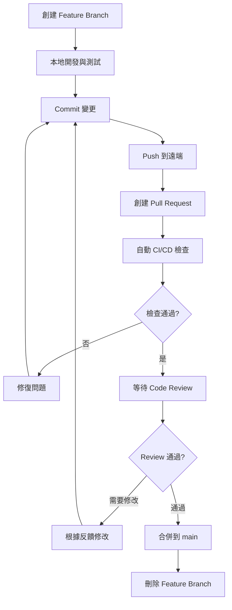

# 🌿 Git Flow 標準化指南

> **文檔版本**: v1.0
> **建立日期**: 2025-12-12
> **目的**: 建立清晰、統一的 Git 分支管理標準

---

## 📋 目錄

1. [流程總覽](#流程總覽)
2. [分支命名規範](#分支命名規範)
3. [Commit Message 規範](#commit-message-規範)
4. [Pull Request 流程](#pull-request-流程)
5. [Branch Protection Rules](#branch-protection-rules)
6. [常見場景與操作](#常見場景與操作)

---

## 🚀 流程總覽

### 完整三階段流程圖

```
 ┌───────────────────────────────┐
 │ 1. Template Repository        │
 │    (公開，CTF 模板框架)       │
 │   - ctf-template code         │
 │   - scripts/validate.py       │
 │   - docs + workflow 指南      │
 └───────────────────────────────┘
                   │
     Use this template│建立 Private Repo
                   ▼
 ┌───────────────────────────────┐
 │ 2. Private Challenge Repo     │
 │    (is1ab-org / private)      │
 │                               │
 │    ┌─ Feature Branch per 題目 ──┐
 │    │ (challenge/xxx)           │
 │    └───────────────────────────┘
 │  - 開發者在 feature 分支寫題目  │
 │  - 用 validate / docker test   │
 │  - PR → main branch            │
 │                                │
 └───────────────────────────────┘
                   │
  (比賽結束/審核通過後)      ↓
                   │
 ┌───────────────────────────────┐
 │ 3. Public Repository          │
 │     (is1ab-org / public)      │
 │  - 只包含公開題目輸出          │
 │  - 不含 flag / sensitive data │
 │  - Contains site JSON/HTML    │
 └───────────────────────────────┘
                   │
                   ▼
 ┌───────────────────────────────┐
 │ 4. GitHub Pages 展示           │
 │  - Deploy index & challenge   │
 │    pages                      │
 │  - 自動／手動 publish         │
 └───────────────────────────────┘
```

### 簡化流程圖

```
┌──────────────┐      ┌──────────────┐      ┌──────────────┐      ┌──────────────┐
│ Template     │      │ Private Dev  │      │ Public       │      │ GitHub Pages │
│ Repo (public)│────▶│ Challenge    │────▶│ Repo (public)│────▶│ Static Site  │
│              │      │ Repo (private)│      │              │      │              │
└──────────────┘      └──────────────┘      └──────────────┘      └──────────────┘

1. Use Template → Create Private Repo
2. Create feature branches per challenge
3. Perform PR review & merge
4. After competition → Export to Public Repo
5. Deploy GitHub Pages
```

---

## 🌿 分支命名規範

### 主要分支

```
main                          # 主分支，保護分支，僅允許通過 PR 合併
```

**main 分支特性**:
- ✅ 始終保持可部署狀態
- ✅ 所有變更必須通過 PR
- ✅ 需要至少 1 位 Reviewer 審核
- ✅ 必須通過所有 CI/CD 檢查

### 功能分支（Feature Branches）

#### 題目開發分支

**格式**: `challenge/<category>/<name>`

**範例**:
```bash
challenge/web/sql-injection           # Web 類別 SQL 注入題目
challenge/pwn/buffer-overflow         # Pwn 類別緩衝區溢出題目
challenge/crypto/rsa-attack           # Crypto 類別 RSA 攻擊題目
challenge/reverse/crackme             # Reverse 類別逆向工程題目
challenge/misc/steganography          # Misc 類別隱寫術題目
challenge/forensics/disk-analysis     # Forensics 類別磁碟分析題目
challenge/blockchain/smart-contract   # Blockchain 類別智能合約題目
```

**命名規則**:
- 使用小寫字母
- 單詞之間用 `-` 連接
- 類別名稱必須是標準類別之一
- 題目名稱要簡潔且描述性強

#### 功能開發分支

**格式**: `feature/<feature-name>`

**範例**:
```bash
feature/web-gui-enhancement           # Web GUI 功能增強
feature/auto-scoring-system           # 自動評分系統
feature/hint-system                   # 提示系統
feature/multi-language-support        # 多語言支援
```

#### Bug 修復分支

**格式**: `fix/<bug-description>`

**範例**:
```bash
fix/validate-script-error             # 修復驗證腳本錯誤
fix/docker-build-failure              # 修復 Docker 建構失敗
fix/security-scan-false-positive      # 修復安全掃描誤報
```

#### 文檔更新分支

**格式**: `docs/<doc-name>`

**範例**:
```bash
docs/update-security-guide            # 更新安全指南
docs/add-git-workflow                 # 新增 Git 工作流程文檔
docs/improve-readme                   # 改善 README
```

#### 發布分支（可選）

**格式**: `release/<version>`

**範例**:
```bash
release/2025-01-final                 # 2025 年 1 月最終版本
release/v1.0.0                        # 版本 1.0.0
release/2025-spring-ctf               # 2025 春季 CTF
```

---

## 📝 Commit Message 規範

### Conventional Commits 格式

採用 [Conventional Commits](https://www.conventionalcommits.org/) 標準:

```
<type>(<scope>): <subject>

<body>

<footer>
```

### Type 類型

| Type | 用途 | 範例 |
|------|------|------|
| `feat` | 新功能（新題目） | `feat(web): add sql-injection challenge` |
| `fix` | Bug 修復 | `fix(scripts): resolve validation error` |
| `docs` | 文檔更新 | `docs(readme): update workflow guide` |
| `style` | 格式調整（不影響代碼運行） | `style: format python code` |
| `refactor` | 重構 | `refactor(validate): improve error handling` |
| `test` | 測試相關 | `test(challenge): add docker test` |
| `chore` | 雜項（依賴更新、配置調整） | `chore(deps): update dependencies` |
| `perf` | 性能優化 | `perf(scan): optimize scanning speed` |
| `ci` | CI/CD 相關 | `ci: add security scan workflow` |
| `build` | 建構系統 | `build: update docker configuration` |

### Scope 範圍

常用 scope:
- `web`, `pwn`, `crypto`, `reverse`, `misc`, `forensics`, `blockchain` - 題目類別
- `scripts` - 腳本工具
- `docs` - 文檔
- `ci` - CI/CD
- `config` - 配置
- `deps` - 依賴

### Subject 主題

- 使用現在式、祈使語氣 ("add", 不是 "added" 或 "adds")
- 不要大寫首字母
- 結尾不加句號
- 限制在 50 字元以內

### Body 內容（可選）

- 詳細說明變更的原因和內容
- 每行限制在 72 字元以內
- 可以包含多個段落

### Footer 頁尾（可選）

- 引用相關 Issue: `Closes #123`, `Fixes #456`
- 破壞性變更: `BREAKING CHANGE: description`

### 完整範例

#### 範例 1: 新增題目

```bash
feat(web): add sql-injection challenge

- 新增 SQL 注入基礎題目
- 難度：middle (200 points)
- 包含完整的 writeup 和測試環境
- Docker 部署支援

題目特色：
- 支援 blind SQL injection
- 提供多種注入方式練習
- 包含 WAF 繞過技巧

Closes #123
```

#### 範例 2: 修復 Bug

```bash
fix(scripts): resolve validation error for docker-compose

修復驗證腳本在檢查 docker-compose.yml 時的路徑錯誤。

問題：
- 腳本無法正確識別巢狀目錄中的 docker-compose.yml
- 導致驗證失敗即使檔案存在

解決方案：
- 使用遞迴搜尋
- 改善路徑處理邏輯

Fixes #456
```

#### 範例 3: 文檔更新

```bash
docs(readme): update workflow guide with feature branch approach

- 移除 Fork 工作流程說明
- 新增 Feature Branch 工作流程
- 更新流程圖
- 新增範例指令

參考文檔：
- docs/git-flow-standard.md
- docs/IMPROVEMENT_IMPLEMENTATION_GUIDE.md
```

#### 範例 4: 重構

```bash
refactor(validate): improve challenge structure validation

重構題目結構驗證邏輯，提高可讀性和可維護性。

變更：
- 將驗證邏輯分離為獨立函數
- 新增詳細的錯誤訊息
- 改善錯誤處理流程
- 新增單元測試

效能提升：20%
```

---

## 🔄 Pull Request 流程

### 標準 PR 流程圖



### 詳細步驟

#### Step 1: 創建 Feature Branch

```bash
# 確保在最新的 main 分支
git checkout main
git pull origin main

# 創建 feature branch
git checkout -b challenge/web/my-challenge

# 或使用題目創建腳本（會自動創建分支）
uv run python scripts/create-challenge.py web my-challenge middle --author YourName
```

#### Step 2: 本地開發與測試

```bash
# 開發題目內容
# 編輯 challenges/web/my-challenge/*

# 本地驗證
uv run python scripts/validate-challenge.py challenges/web/my-challenge/

# Docker 測試（如適用）
cd challenges/web/my-challenge/docker/
docker-compose up -d
# 測試題目功能
docker-compose down
```

#### Step 3: Commit 變更

```bash
# 查看變更
git status
git diff

# 添加檔案
git add challenges/web/my-challenge/

# 提交（使用 Conventional Commits 格式）
git commit -m "feat(web): add my-challenge

- 新增題目描述
- 難度：middle (200 points)
- 包含完整的 writeup 和測試環境
- Docker 部署支援"
```

#### Step 4: Push 到遠端

```bash
# 推送到遠端
git push origin challenge/web/my-challenge

# 如果是第一次推送，使用 -u 設置上游
git push -u origin challenge/web/my-challenge
```

#### Step 5: 創建 Pull Request

在 GitHub 上創建 PR:

1. 前往 Repository 頁面
2. 點擊 "Pull requests" → "New pull request"
3. 選擇分支:
   - **Base**: `main`
   - **Compare**: `challenge/web/my-challenge`
4. 填寫 PR 資訊（使用模板）

### PR 模板

```markdown
## 📋 變更內容

- [x] 新增題目
- [ ] 修復問題
- [ ] 更新文檔
- [ ] 其他: ___________

## 🎯 題目資訊

**題目名稱**: My Challenge
**分類**: Web
**難度**: Middle
**估計分數**: 200
**是否需要部署**: Yes / No

## 📝 變更說明

<!-- 詳細描述你的變更 -->

新增一個中等難度的 Web 題目，適合初學者學習...

## ✅ 檢查清單

請確認以下項目已完成：

### 基本檢查
- [x] 本地測試通過
- [x] 題目結構完整
- [x] 配置檔案正確

### 題目內容
- [x] `public.yml` 已填寫完整
- [x] `private.yml` 包含 flag 和內部資訊
- [x] 題目描述清晰
- [x] Writeup 已完成

### 部署相關（如適用）
- [x] Docker 建構成功
- [x] docker-compose.yml 配置正確
- [x] 環境變數設置正確
- [x] 端口配置無衝突

### 安全檢查
- [x] 沒有硬編碼 flag
- [x] 沒有敏感資料洩漏
- [x] 通過 `scan-secrets.py` 掃描

### 程式碼品質
- [x] 符合程式碼規範
- [x] 變數命名清晰
- [x] 有適當的註解

## 🔗 相關連結

- Related Issue: #123
- 參考文檔: [連結]

## 📸 截圖（可選）

<!-- 如果適用，請提供截圖 -->

## 💬 其他說明

<!-- 任何其他需要說明的內容 -->

---

🤖 提醒：PR 合併後，feature branch 將自動刪除
```

#### Step 6: 等待 CI/CD 檢查

PR 創建後，會自動觸發以下檢查:

✅ **結構驗證** (`validate-challenge.yml`)
- 檢查題目目錄結構
- 驗證 YAML 配置
- 檢查必要檔案

✅ **安全掃描** (`security-scan.yml`)
- Flag 洩漏檢測
- 敏感檔案檢查
- Docker 安全檢查

✅ **Docker 建構測試** (如適用)
- 建構 Docker 映像
- 測試容器啟動
- 檢查端口配置

#### Step 7: Code Review

**Reviewer 檢查項目**:

📋 **題目內容**:
- [ ] 題目描述清楚且有趣
- [ ] 難度設定合理
- [ ] 分數設定適當
- [ ] Writeup 詳細完整

🔒 **安全性**:
- [ ] 無敏感資料洩露
- [ ] Flag 格式正確
- [ ] 無硬編碼密碼或密鑰

🐳 **部署配置**:
- [ ] Docker 配置正確
- [ ] 環境變數設置合理
- [ ] 端口無衝突

💻 **程式碼品質**:
- [ ] 程式碼清晰易讀
- [ ] 有適當的註解
- [ ] 符合團隊規範

#### Step 8: 處理 Review 意見

```bash
# 根據 review 意見修改
# 編輯檔案...

# 提交修改
git add .
git commit -m "fix: address review comments

- 修正題目描述
- 更新 Docker 配置
- 改善錯誤處理"

# 推送更新
git push origin challenge/web/my-challenge
```

#### Step 9: 合併 PR

當所有檢查通過且獲得審核批准後:

1. **Squash and Merge** (推薦)
   - 將所有 commits 合併為一個
   - 保持 main 分支歷史整潔

2. **Merge Commit**
   - 保留完整的 commit 歷史
   - 用於重要的功能分支

3. **Rebase and Merge**
   - 線性歷史
   - 適合簡單的變更

#### Step 10: 清理

```bash
# PR 合併後，刪除本地 feature branch
git checkout main
git pull origin main
git branch -d challenge/web/my-challenge

# 刪除遠端 branch（通常 GitHub 會自動處理）
git push origin --delete challenge/web/my-challenge
```

---

## 🔒 Branch Protection Rules

### main 分支保護設定

在 GitHub Repository Settings → Branches → Branch protection rules:

```yaml
Branch name pattern: main

Settings:
  ✅ Require a pull request before merging
    ✅ Require approvals: 1
    ✅ Dismiss stale pull request approvals when new commits are pushed
    ✅ Require review from Code Owners (可選)

  ✅ Require status checks to pass before merging
    ✅ Require branches to be up to date before merging
    Required status checks:
      - validate-challenge
      - security-scan
      - docker-build (if applicable)

  ✅ Require conversation resolution before merging

  ✅ Require signed commits (建議)

  ✅ Require linear history (可選)

  ✅ Include administrators
    ⚠️ 即使是管理員也必須遵守保護規則

  ❌ Allow force pushes
    ⚠️ 禁止強制推送以保護歷史

  ❌ Allow deletions
    ⚠️ 禁止刪除 main 分支
```

### 自動化設定腳本

創建 `.github/scripts/setup-branch-protection.sh`:

```bash
#!/bin/bash
# Branch Protection Setup Script

REPO_OWNER="your-org"
REPO_NAME="2025-is1ab-CTF"
BRANCH="main"
GITHUB_TOKEN="${GITHUB_TOKEN}"

curl -X PUT \
  -H "Accept: application/vnd.github.v3+json" \
  -H "Authorization: token ${GITHUB_TOKEN}" \
  https://api.github.com/repos/${REPO_OWNER}/${REPO_NAME}/branches/${BRANCH}/protection \
  -d '{
    "required_status_checks": {
      "strict": true,
      "contexts": ["validate-challenge", "security-scan"]
    },
    "enforce_admins": true,
    "required_pull_request_reviews": {
      "dismiss_stale_reviews": true,
      "require_code_owner_reviews": false,
      "required_approving_review_count": 1
    },
    "restrictions": null,
    "required_linear_history": false,
    "allow_force_pushes": false,
    "allow_deletions": false,
    "required_conversation_resolution": true
  }'
```

---

## 📚 常見場景與操作

### 場景 1: 同步最新的 main 分支

```bash
# 在 feature branch 上
git checkout challenge/web/my-challenge

# 拉取最新的 main
git fetch origin main
git merge origin/main

# 或使用 rebase（產生更整潔的歷史）
git rebase origin/main

# 解決衝突（如有）
# 編輯衝突檔案...
git add .
git rebase --continue

# 推送更新
git push origin challenge/web/my-challenge --force-with-lease
```

### 場景 2: 修改最近的 Commit

```bash
# 修改最後一次 commit
git commit --amend -m "feat(web): updated commit message"

# 推送（需要 force push）
git push origin challenge/web/my-challenge --force-with-lease
```

### 場景 3: 合併多個 Commits

```bash
# 互動式 rebase
git rebase -i HEAD~3  # 合併最近 3 個 commits

# 在編輯器中，將除第一個外的 commit 從 "pick" 改為 "squash"
# 儲存並關閉編輯器

# 編輯合併後的 commit message
# 儲存並關閉

# 推送
git push origin challenge/web/my-challenge --force-with-lease
```

### 場景 4: 撤銷錯誤的 Commit

```bash
# 撤銷最後一次 commit（保留變更）
git reset --soft HEAD~1

# 撤銷最後一次 commit（不保留變更）
git reset --hard HEAD~1

# 推送（需要 force push）
git push origin challenge/web/my-challenge --force-with-lease
```

### 場景 5: 解決合併衝突

```bash
# 嘗試合併 main
git merge origin/main

# 如果有衝突，Git 會提示
# 編輯衝突檔案，解決衝突標記：
# <<<<<<< HEAD
# 你的變更
# =======
# 他人的變更
# >>>>>>> origin/main

# 標記為已解決
git add <conflict-file>

# 完成合併
git commit -m "merge: resolve conflicts with main"

# 推送
git push origin challenge/web/my-challenge
```

### 場景 6: 創建 Hotfix

```bash
# 從 main 創建 hotfix branch
git checkout main
git pull origin main
git checkout -b fix/critical-security-issue

# 修復問題
# ...

# 提交
git commit -m "fix: resolve critical security vulnerability

SECURITY: 修復 XXX 安全漏洞
影響範圍：...
解決方案：..."

# 推送並創建 PR（標記為 urgent）
git push origin fix/critical-security-issue
```

---

## 🛠️ 實用 Git 命令

### 查看狀態

```bash
# 查看當前狀態
git status

# 查看簡短狀態
git status -s

# 查看分支
git branch -a

# 查看遠端
git remote -v
```

### 查看歷史

```bash
# 查看 commit 歷史
git log

# 單行顯示
git log --oneline

# 圖形化顯示
git log --graph --oneline --all

# 查看特定檔案的歷史
git log -- <file>

# 查看特定作者的 commits
git log --author="YourName"
```

### 比較差異

```bash
# 查看未暫存的變更
git diff

# 查看已暫存的變更
git diff --staged

# 比較兩個分支
git diff main..challenge/web/my-challenge

# 比較兩個 commits
git diff commit1 commit2
```

### 暫存變更

```bash
# 暫存當前變更
git stash

# 暫存包含未追蹤的檔案
git stash -u

# 列出所有 stash
git stash list

# 恢復最近的 stash
git stash pop

# 恢復特定 stash
git stash apply stash@{0}

# 刪除 stash
git stash drop stash@{0}
```

---

## 📞 獲取幫助

### 遇到問題？

1. **查閱文檔**:
   - [Git 官方文檔](https://git-scm.com/doc)
   - [GitHub Flow](https://guides.github.com/introduction/flow/)
   - [Conventional Commits](https://www.conventionalcommits.org/)

2. **團隊支援**:
   - 詢問 Maintainer
   - 在 GitHub Discussions 提問
   - 參加團隊會議

3. **常見問題**:
   - [FAQ](faq.md)
   - [故障排除指南](security-workflow-guide.md#故障排除)

---

## 📚 相關文檔

- [5 分鐘快速入門](getting-started.md)
- [改善實施指南](IMPROVEMENT_IMPLEMENTATION_GUIDE.md)
- [安全流程完整指南](security-workflow-guide.md)
- [角色與權限管理](roles-and-permissions.md)
- [快速參考指南](quick-reference.md)

---

**維護者**: IS1AB Team
**最後更新**: 2025-12-12
**文檔版本**: v1.0
