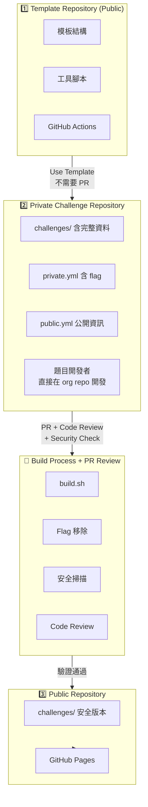
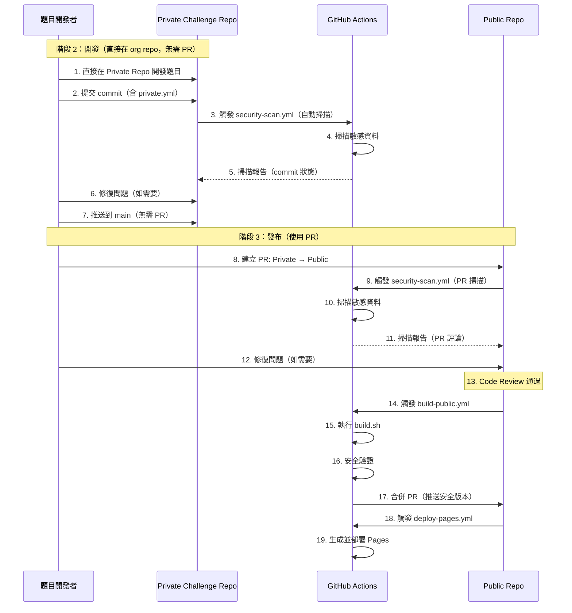

# 🔒 CTF 安全流程完整指南

> 完整的 CTF 題目開發、建置、發布安全流程說明文件

## 📋 目錄

- [概述](#概述)
- [架構設計](#架構設計)
- [快速開始](#快速開始)
- [詳細使用說明](#詳細使用說明)
- [安全流程](#安全流程)
- [最佳實踐](#最佳實踐)
- [故障排除](#故障排除)
- [參考資料](#參考資料)

---

## 概述

### 設計目標

本系統設計旨在解決 CTF 題目開發中的核心安全問題：

1. **Flag 洩漏防護**：確保真實 flag 永遠不會出現在公開 repository
2. **自動化安全掃描**：在每次 PR 和推送時自動檢查敏感資料
3. **安全建置流程**：自動移除敏感資訊並生成安全的公開版本
4. **GitHub Pages 展示**：自動生成美觀的題目展示網站

### 核心特性

- ✅ **Template Repository**：標準化的題目模板結構
- ✅ **分離式管理**：`private.yml`（含 flag）與 `public.yml`（公開資訊）分離
- ✅ **自動化建置**：`build.sh` 自動移除敏感資料
- ✅ **安全掃描**：`scan-secrets.py` 多層次安全檢查
- ✅ **CI/CD 整合**：GitHub Actions 自動化流程
- ✅ **GitHub Pages**：自動生成並部署題目展示網站

---

## 架構設計

### 三階段流程



**重要說明**：
- ⚠️ **階段 1 → 階段 2**：使用 "Use this template"，**不需要 PR**
- ⚠️ **階段 2 開發**：題目作者直接在 org 的 Private Repo 開發，**不需要個人 Fork，不需要 PR**
- ⭐ **階段 2 → 階段 3**：使用 **PR** 進行 Code Review 和安全檢查，**這是唯一使用 PR 的地方**

### 檔案結構

```
is1ab-CTF-template/                    # Template Repository
├── challenge-template/                # 題目模板
│   ├── private.yml.template           # 🔒 敏感資料模板
│   ├── public.yml.template            # 📢 公開資訊模板
│   ├── README.md.template
│   ├── writeup/README.md.template
│   └── docker/
│       ├── Dockerfile.template
│       └── docker-compose.yml.template
├── scripts/
│   ├── build.sh                      # 🔨 核心建置腳本
│   ├── scan-secrets.py               # 🔒 安全掃描器
│   └── generate-pages.py             # 🌐 Pages 生成器
├── .github/workflows/
│   ├── security-scan.yml             # 安全掃描 CI
│   ├── build-public.yml              # 建置公開版本 CI
│   └── deploy-pages.yml              # Pages 部署 CI
└── config.yml                        # 配置檔案（含安全設定）

Private Repository/
└── challenges/
    └── web/sql_injection/
        ├── private.yml               # 🔒 含真實 flag
        ├── public.yml                # 📢 公開資訊（無 flag）
        ├── src/                      # 題目源碼
        ├── docker/                    # Docker 配置
        ├── files/                     # 提供給選手的檔案
        └── writeup/                   # 🔒 官方解答

Public Repository/
├── challenges/                        # 安全版本（無 flag）
│   └── web/sql_injection/
│       ├── public.yml                # ✅ 已過濾
│       ├── README.md                 # ✅ 已過濾
│       └── files/                     # ✅ 安全附件
└── _site/                            # GitHub Pages 靜態網站
```

---

## 快速開始

### 步驟 1：設定 Template Repository

1. **在 GitHub 上啟用 Template 功能**

   ```
   Settings → General → Template repository ✅
   ```

2. **確認 Template 結構**

   ```bash
   git clone https://github.com/your-org/is1ab-CTF-template.git
   cd is1ab-CTF-template

   # 檢查模板檔案
   ls challenge-template/
   ```

### 步驟 2：建立 Private 開發 Repository

1. **使用 Template 建立新 Repository**

   - 在 GitHub 上點擊 "Use this template"
   - Repository name: `2024-is1ab-CTF-private`
   - Visibility: **Private** ✅
   - Include all branches: ✅

2. **Clone 並初始化**

   ```bash
   git clone https://github.com/your-org/2024-is1ab-CTF-private.git
   cd 2024-is1ab-CTF-private

   # 安裝依賴
   uv sync
   ```

3. **配置 `config.yml`**

   ```yaml
   project:
     name: "2024-is1ab-CTF"
     year: 2024
     organization: "is1ab"
     flag_prefix: "is1abCTF"

   public_release:
     repository:
       name: "your-org/2024-is1ab-CTF-public"
       branch: "main"
   ```

### 步驟 3：建立第一個題目

```bash
# 使用腳本建立題目
uv run python scripts/create-challenge.py web sql_injection easy --author YourName

# 進入題目目錄
cd challenges/web/sql_injection
```

### 步驟 4：設定題目資料

1. **編輯 `private.yml`**（含真實 flag）

   ```yaml
   flag: "is1abCTF{real_flag_here}"
   flag_type: "static"

   solution_steps:
     - step: 1
       title: "識別漏洞"
       description: "在登入表單中發現 SQL injection 漏洞"
   ```

2. **編輯 `public.yml`**（公開資訊）
   ```yaml
   title: "SQL Injection 101"
   category: "web"
   difficulty: "easy"
   points: 100
   description: "學習基本的 SQL 注入技巧..."
   ready_for_release: false # 開發完成後改為 true
   ```

### 步驟 5：本地測試建置

```bash
# 返回專案根目錄
cd ../../..

# 執行建置（模擬模式）
./scripts/build.sh --dry-run

# 實際建置
./scripts/build.sh --force

# 檢查輸出
ls public-release/challenges/web/sql_injection/
```

---

## 詳細使用說明

### 1. build.sh - 核心建置腳本

#### 基本用法

```bash
# 建置所有準備好的題目
./scripts/build.sh --force

# 只建置特定題目
./scripts/build.sh --challenge challenges/web/sql_injection --force

# 模擬執行（不實際建立檔案）
./scripts/build.sh --dry-run

# 包含 writeup（比賽結束後）
./scripts/build.sh --include-writeups --force

# 詳細輸出
./scripts/build.sh --verbose --force
```

#### 功能說明

`build.sh` 會執行以下步驟：

1. **讀取配置**

   - 從 `config.yml` 讀取 flag 前綴
   - 檢查題目是否標記為 `ready_for_release: true`

2. **處理題目**

   - 複製 `public.yml`（已過濾敏感欄位）
   - 複製 `README.md`（移除 flag 字串）
   - 複製 `files/` 目錄中的安全附件
   - 處理 Docker 配置（移除硬編碼 flag）

3. **安全掃描**

   - 掃描 flag 格式字串
   - 檢查敏感檔案
   - 驗證輸出無敏感資料

4. **生成報告**
   - 建置統計
   - 安全檢查結果
   - 輸出目錄結構

#### 輸出結構

```
public-release/
├── README.md                    # 自動生成的總體 README
├── challenges/
│   └── web/
│       └── sql_injection/
│           ├── public.yml       # ✅ 已過濾
│           ├── README.md        # ✅ 已過濾
│           └── files/           # ✅ 安全附件
└── build-report.md              # 建置報告
```

### 2. scan-secrets.py - 安全掃描器

#### 基本用法

```bash
# 掃描當前目錄
uv run python scripts/scan-secrets.py

# 掃描特定路徑
uv run python scripts/scan-secrets.py --path public-release

# 輸出 Markdown 報告
uv run python scripts/scan-secrets.py --format markdown --output report.md

# 發現 HIGH 等級問題時失敗
uv run python scripts/scan-secrets.py --fail-on-high

# 安靜模式（只輸出結果碼）
uv run python scripts/scan-secrets.py --quiet
```

#### 掃描項目

1. **Flag 格式掃描**

   - 掃描 `is1abCTF{...}` 格式
   - 掃描其他常見 CTF flag 格式

2. **敏感檔案檢查**

   - `private.yml`
   - `flag.txt`
   - `.env` 檔案
   - `secrets.json`

3. **YAML/JSON 敏感欄位**

   - `flag`, `flags`
   - `solution_steps`
   - `internal_notes`
   - `test_credentials`

4. **Docker 配置檢查**

   - Dockerfile 中的硬編碼 flag
   - docker-compose.yml 中的環境變數

5. **模式匹配**
   - 硬編碼密碼
   - API Keys
   - AWS Keys
   - 私鑰

#### 嚴重程度等級

- **CRITICAL**：絕對不能有（如 flag、私鑰）
- **HIGH**：高風險（如密碼、API Key）
- **MEDIUM**：中風險（如可能的編碼資料）
- **LOW**：低風險（資訊提示）

### 3. generate-pages.py - GitHub Pages 生成器

#### 基本用法

```bash
# 生成網站
uv run python scripts/generate-pages.py \
    --input public-release \
    --output _site \
    --theme dark

# 使用 light 主題
uv run python scripts/generate-pages.py --theme light

# 從 challenges 目錄生成（預覽模式）
uv run python scripts/generate-pages.py \
    --input challenges \
    --output _preview \
    --theme dark
```

#### 生成內容

1. **首頁 (`index.html`)**

   - 統計資訊
   - 最新題目
   - 分類預覽

2. **分類頁面 (`web.html`, `pwn.html`, ...)**

   - 該分類的所有題目
   - 題目卡片展示

3. **題目詳情頁面 (`challenges/web/sql_injection/index.html`)**

   - 完整題目描述
   - 附件下載
   - 提示系統
   - 標籤和元資料

4. **搜尋頁面 (`search.html`)**

   - 即時搜尋功能
   - 關鍵字高亮

5. **JSON 資料 (`challenges.json`)**
   - 機器可讀的題目資料
   - 用於 API 或自動化

#### 主題設定

- **dark**：深色主題（預設）
- **light**：淺色主題

### 4. GitHub Actions Workflows

#### security-scan.yml

**觸發時機：**

- Push 到 `main` 或 `develop` 分支
- Pull Request
- 手動觸發

**功能：**

- Flag 洩漏掃描
- 敏感檔案檢查
- Docker 安全檢查
- 第三方安全工具（TruffleHog, GitLeaks）

**使用方式：**

```bash
# 自動觸發（無需手動操作）
# 或在 Actions 頁面手動觸發
```

#### build-public.yml

**觸發時機：**

- Push 到 `main` 分支（challenges 有變更）
- 手動觸發

**功能：**

- 執行 `build.sh`
- 安全驗證
- 推送到 public repository

**手動觸發參數：**

- `target_repo`：目標 public repository
- `include_writeups`：是否包含 writeup
- `force_rebuild`：強制重新建置
- `dry_run`：模擬執行

**使用方式：**

```yaml
# 在 GitHub Actions 頁面：
# 1. 選擇 "Build Public Release"
# 2. 點擊 "Run workflow"
# 3. 填入參數
# 4. 執行
```

#### deploy-pages.yml

**觸發時機：**

- `public-release/` 目錄有變更
- 手動觸發

**功能：**

- 生成 GitHub Pages 網站
- 部署到 GitHub Pages
- 部署後驗證

**手動觸發參數：**

- `theme`：網站主題（dark/light）
- `source_dir`：來源目錄
- `include_challenges`：是否從 challenges 生成

**使用方式：**

```yaml
# 自動觸發（public-release 更新時）
# 或在 Actions 頁面手動觸發
```

---

## 安全流程

### 開發與發布流程



**關鍵點**：
- ⚠️ **階段 2 開發**：直接在 Private Repo 提交 commit，**不需要 PR**
- ⭐ **階段 3 發布**：使用 **PR** 從 Private Repo 到 Public Repo，進行 Code Review 和安全檢查

### 安全檢查點

#### 1. PR 階段

- ✅ Flag 格式掃描
- ✅ 敏感檔案檢查
- ✅ Docker 配置檢查
- ✅ YAML 欄位驗證

#### 2. 建置階段

- ✅ `build.sh` 移除敏感資料
- ✅ 輸出目錄二次掃描
- ✅ Flag 洩漏驗證
- ✅ 敏感檔案驗證

#### 3. 部署階段

- ✅ Pages 生成前掃描
- ✅ 部署後驗證
- ✅ 網站內容檢查

### 敏感資料處理

#### private.yml 欄位（不會出現在 public.yml）

```yaml
# 🔒 這些欄位永遠不會同步到 public repo
flag: "is1abCTF{...}"
flag_type: "static"
flag_description: "..."
solution_steps: [...]
internal_notes: "..."
test_credentials: { ... }
deploy_secrets: { ... }
verified_solutions: [...]
```

#### public.yml 欄位（安全公開）

```yaml
# ✅ 這些欄位可以安全公開
title: "..."
category: "..."
difficulty: "..."
points: 100
description: "..."
author: "..."
tags: [...]
hints: [...]
files: [...]
```

---

## 最佳實踐

### 1. 題目開發

#### ✅ 推薦做法

- **分離敏感資料**

  ```yaml
  # private.yml
  flag: "is1abCTF{real_flag}"
  # public.yml
  # ❌ 不要包含 flag
  ```

- **使用佔位符**

  ```yaml
  # Dockerfile
  ENV FLAG="${FLAG}" # ✅ 使用環境變數

  # ❌ 不要硬編碼
  # ENV FLAG="is1abCTF{...}"
  ```

- **標記發布狀態**
  ```yaml
  # public.yml
  ready_for_release: false  # 開發中
  ready_for_release: true   # 準備發布
  ```

#### ❌ 避免做法

- ❌ 在 `public.yml` 中包含 flag
- ❌ 在 README.md 中寫入真實 flag
- ❌ 在 Docker 配置中硬編碼 flag
- ❌ 將 `private.yml` 提交到 public repo

### 2. 安全掃描

#### 定期掃描

```bash
# 開發過程中定期掃描
uv run python scripts/scan-secrets.py --path challenges

# PR 前掃描
uv run python scripts/scan-secrets.py --path . --fail-on-high
```

#### 掃描配置

在 `config.yml` 中調整掃描嚴格度：

```yaml
security:
  scan_level: "normal" # strict | normal | relaxed
```

### 3. 建置流程

#### 建置前檢查

```bash
# 1. 確認題目標記為 ready_for_release
grep "ready_for_release: true" challenges/*/public.yml

# 2. 執行安全掃描
uv run python scripts/scan-secrets.py --path challenges

# 3. 模擬建置
./scripts/build.sh --dry-run

# 4. 實際建置
./scripts/build.sh --force
```

#### 建置後驗證

```bash
# 檢查輸出
ls public-release/challenges/

# 驗證無 flag 洩漏
uv run python scripts/scan-secrets.py --path public-release

# 檢查建置報告
cat build-report.md
```

### 4. GitHub Pages

#### 主題選擇

- **dark**：適合技術社群，減少眼睛疲勞
- **light**：適合列印和簡報

#### 自訂配置

在 `config.yml` 中設定：

```yaml
github_pages:
  theme: "dark"
  display:
    show_author: true
    show_points: true
    show_hints: true
```

---

## 故障排除

### 常見問題

#### 1. build.sh 執行失敗

**問題：** `build.sh: Permission denied`

**解決：**

```bash
chmod +x scripts/build.sh
```

**問題：** `找不到題目目錄`

**解決：**

```bash
# 確認目錄結構
ls challenges/

# 確認 public.yml 存在
ls challenges/*/public.yml
```

**問題：** `Flag 洩漏檢查失敗`

**解決：**

```bash
# 檢查哪些檔案包含 flag
grep -r "is1abCTF{" challenges/

# 移除或替換為佔位符
```

#### 2. 安全掃描失敗

**問題：** `發現 CRITICAL 等級問題`

**解決：**

```bash
# 查看詳細報告
uv run python scripts/scan-secrets.py --path . --format markdown --output report.md
cat report.md

# 修復發現的問題
# - 移除硬編碼 flag
# - 刪除敏感檔案
# - 更新 YAML 欄位
```

**問題：** `假陽性（False Positive）`

**解決：**

```yaml
# 在 config.yml 中調整模式
security:
  sensitive_patterns:
    - pattern: "example_flag" # 排除範例
      severity: "INFO"
```

#### 3. GitHub Actions 失敗

**問題：** `security-scan.yml 失敗`

**解決：**

1. 查看 Actions 日誌
2. 檢查 PR 評論中的掃描報告
3. 修復發現的問題
4. 重新提交

**問題：** `build-public.yml 推送失敗`

**解決：**

1. 確認 `PUBLIC_REPO_TOKEN` secret 已設定
2. 確認目標 repository 存在
3. 檢查權限設定

**問題：** `deploy-pages.yml 部署失敗`

**解決：**

1. 確認 GitHub Pages 已啟用
2. 確認 Source 設為 "GitHub Actions"
3. 檢查部署日誌

#### 4. Pages 生成問題

**問題：** `找不到題目`

**解決：**

```bash
# 確認來源目錄
ls public-release/challenges/

# 確認 public.yml 存在
find public-release -name "public.yml"
```

**問題：** `樣式顯示異常`

**解決：**

```bash
# 確認 style.css 已生成
ls _site/style.css

# 檢查路徑是否正確
# 相對路徑應為 ../../style.css
```

### 除錯技巧

#### 啟用詳細輸出

```bash
# build.sh
./scripts/build.sh --verbose --force

# scan-secrets.py
uv run python scripts/scan-secrets.py --path . --verbose

# generate-pages.py
uv run python scripts/generate-pages.py --input . --output _site --verbose
```

#### 檢查中間產物

```bash
# 檢查建置輸出
ls -la public-release/

# 檢查掃描結果
cat security-report.md

# 檢查 Pages 生成
ls -la _site/
```

#### 本地測試 CI

```bash
# 模擬 security-scan
uv run python scripts/scan-secrets.py --path . --fail-on-high

# 模擬 build-public
./scripts/build.sh --force
uv run python scripts/scan-secrets.py --path public-release

# 模擬 deploy-pages
uv run python scripts/generate-pages.py --input public-release --output _site
```

---

## 參考資料

### 檔案結構參考

```
challenge-template/              # 題目模板
├── private.yml.template         # 敏感資料模板
├── public.yml.template          # 公開資訊模板
├── README.md.template           # 題目說明模板
└── docker/
    ├── Dockerfile.template      # Docker 配置模板
    └── docker-compose.yml.template

scripts/                         # 工具腳本
├── build.sh                    # 建置腳本
├── scan-secrets.py             # 安全掃描器
└── generate-pages.py           # Pages 生成器

.github/workflows/               # CI/CD
├── security-scan.yml           # 安全掃描 CI
├── build-public.yml            # 建置公開版本 CI
└── deploy-pages.yml            # Pages 部署 CI
```

### 配置參考

#### config.yml 關鍵設定

```yaml
# Flag 前綴
project:
  flag_prefix: "is1abCTF"

# 安全掃描等級
security:
  scan_level: "normal" # strict | normal | relaxed

# 公開 repository
public_release:
  repository:
    name: "your-org/repo-name"

# GitHub Pages
github_pages:
  theme: "dark"
  enabled: true
```

### 命令參考

#### build.sh

```bash
./scripts/build.sh [options]

選項:
  -h, --help              顯示幫助
  -o, --output DIR        指定輸出目錄
  -c, --challenge PATH    只建置指定題目
  -f, --force             強制覆蓋
  -n, --dry-run           模擬執行
  -v, --verbose           詳細輸出
  --skip-scan             跳過掃描（不建議）
  --include-writeups      包含 writeup
```

#### scan-secrets.py

```bash
uv run python scripts/scan-secrets.py [options]

選項:
  --path PATH             掃描路徑
  --format FORMAT         輸出格式（text/markdown/json）
  --output FILE           輸出檔案
  --verbose               詳細輸出
  --quiet                 安靜模式
  --fail-on-high         發現 HIGH 時失敗
  --fail-on-critical      發現 CRITICAL 時失敗（預設）
```

#### generate-pages.py

```bash
uv run python scripts/generate-pages.py [options]

選項:
  --input DIR             輸入目錄
  --output DIR           輸出目錄
  --config FILE           配置檔案
  --theme THEME           主題（dark/light）
```

### GitHub Actions Secrets

需要在 Repository Settings → Secrets 中設定：

| Secret 名稱         | 說明                         | 範例                          |
| ------------------- | ---------------------------- | ----------------------------- |
| `PUBLIC_REPO_TOKEN` | Public repository 推送 token | `ghp_...`                     |
| `PUBLIC_REPO`       | Public repository 名稱       | `your-org/repo-name`          |
| `SLACK_WEBHOOK_URL` | Slack 通知 Webhook（可選）   | `https://hooks.slack.com/...` |

### 相關文檔

- [Challenge Creation Guide](challenge-creation-guide.md)
- [Deployment Guide](deployment-guide.md)
- [Quick Start Guide](quick-start-guide.md)

---

## 總結

本安全流程系統提供了：

1. **完整的模板結構**：標準化的題目開發模板
2. **自動化建置流程**：一鍵生成安全的公開版本
3. **多層次安全掃描**：確保無敏感資料洩漏
4. **自動化 CI/CD**：GitHub Actions 自動化流程
5. **美觀的展示網站**：GitHub Pages 自動部署

遵循本指南，您可以安全、高效地管理 CTF 題目的開發和發布流程。

如有問題，請參考故障排除章節或聯繫維護團隊。

---

**最後更新**：2025-01-XX  
**版本**：2.0.0  
**維護者**：IS1AB Team
