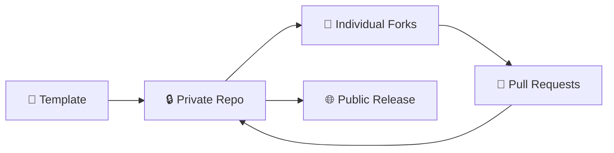

# 🚀 三階段 CTF 工作流程教學

本教學將詳細介紹如何使用 is1ab-CTF-template 進行完整的 CTF 比賽開發流程，從模板 Fork 到公開發布的三個階段。

## 📋 工作流程概覽



### 三個階段說明

1. **🏗️ 階段一：建立私有倉庫** - 從模板 Fork 建立組織的私有開發倉庫
2. **👥 階段二：個人開發** - 團隊成員 Fork 私有倉庫進行題目開發
3. **🚀 階段三：公開發布** - 比賽後將安全內容發布到公開倉庫

---

## 🏗️ 階段一：建立私有倉庫

### 1.1 Fork 模板倉庫

```bash
# 方法一：使用 GitHub Web 介面
# 1. 前往 https://github.com/is1ab/is1ab-CTF-template
# 2. 點擊 "Use this template" > "Create a new repository"
# 3. 設定倉庫名稱：2024-is1ab-CTF
# 4. 選擇組織：your-organization
# 5. 設定為 Private
# 6. 點擊 "Create repository"

# 方法二：使用 GitHub CLI
gh repo create your-org/2024-is1ab-CTF \
  --template is1ab/is1ab-CTF-template \
  --private \
  --description "is1ab CTF 2024 - Private Development Repository"
```

### 1.2 克隆並初始化

```bash
# 克隆私有倉庫
git clone git@github.com:your-org/2024-is1ab-CTF.git
cd 2024-is1ab-CTF

# 安裝依賴
uv venv
source .venv/bin/activate  # Linux/Mac
# .venv\Scripts\activate   # Windows
uv pip install -r requirements.txt

# 初始化專案
uv run scripts/init-project.py --year 2024 --org is1ab --name "2024-is1ab-CTF"
```

### 1.3 配置專案設定

編輯 `config.yml` 檔案：

```yaml
project:
  name: "2024-is1ab-CTF"
  year: 2024
  organization: "is1ab"
  flag_prefix: "is1abCTF"
  description: "is1ab CTF 2024 Competition"

# 設定題目配額
challenge_quota:
  by_category:
    general: 2
    web: 6
    pwn: 6
    reverse: 4
    crypto: 4
    forensic: 3
    misc: 3
  by_difficulty:
    baby: 8
    easy: 10
    middle: 8
    hard: 4
    impossible: 2
  total_target: 32

# 團隊設定
team:
  default_author: "is1ab-team"
  reviewers: ["admin", "senior-dev"]

# 平台設定
platform:
  gzctf_url: "http://your-platform.com"
  deployment_host: "your-server.com"
```

### 1.4 設定權限與保護

```bash
# 設定分支保護（透過 GitHub Web 介面或 CLI）
gh api repos/your-org/2024-is1ab-CTF/branches/main/protection \
  --method PUT \
  --field required_status_checks='{"strict":true,"contexts":["validate"]}' \
  --field enforce_admins=true \
  --field required_pull_request_reviews='{"required_approving_review_count":2}' \
  --field restrictions=null

# 邀請團隊成員
gh api repos/your-org/2024-is1ab-CTF/collaborators/username \
  --method PUT \
  --field permission=push
```

### 1.5 測試 Web 介面

```bash
# 啟動開發服務器
cd web-interface
python server.py --host localhost --port 8000

# 在瀏覽器中開啟 http://localhost:8000
# 確認可以看到題目進度和管理介面
```

---

## 👥 階段二：個人開發流程

### 2.1 個人 Fork 私有倉庫

每位團隊成員需要 Fork 組織的私有倉庫：

```bash
# 使用 GitHub CLI Fork
gh repo fork your-org/2024-is1ab-CTF --clone

# 或使用 Web 介面
# 1. 前往 https://github.com/your-org/2024-is1ab-CTF
# 2. 點擊右上角 "Fork"
# 3. 選擇個人帳號
# 4. 確認 Fork
```

### 2.2 設置開發環境

```bash
# 克隆個人 Fork
git clone git@github.com:your-username/2024-is1ab-CTF.git
cd 2024-is1ab-CTF

# 設定上游倉庫
git remote add upstream git@github.com:your-org/2024-is1ab-CTF.git

# 安裝依賴
uv venv 
uv sync

# 確認環境正常
uv run scripts/check-sensitive.py
```

### 2.3 創建新題目

```bash
# 創建開發分支
git checkout -b challenge/web/sql-injection

# 使用腳本創建題目
uv run scripts/create-challenge.py web sql_injection middle --author YourName

# 編輯題目內容
cd challenges/web/sql_injection/
```

題目目錄結構：
```
challenges/web/sql_injection/
├── README.md              # 題目說明（私有）
├── public.yml             # 公開發布配置
├── private.yml            # 私有配置（包含 flag）
├── src/                   # 源碼目錄
│   ├── app.py
│   └── requirements.txt
├── attachments/           # 附件目錄
│   └── source.zip
├── solution/              # 解題腳本
│   ├── solve.py
│   └── writeup.md
└── docker/                # Docker 配置
    ├── Dockerfile
    └── docker-compose.yml
```

### 2.4 編輯 public.yml

這是最重要的配置檔案，決定哪些內容會被發布：

```yaml
# public.yml
title: "SQL Injection Login Bypass"
category: "web"
difficulty: "middle"
author: "YourName"
points: 300
description: |
  網站的登入功能存在 SQL 注入漏洞，試著繞過登入驗證取得管理員權限。
  
  提示：試試看萬能密碼吧！

# 準備發布標記（開發完成後設為 true）
ready_for_release: false

# 允許發布的檔案（使用 glob 模式）
allowed_files:
  - "attachments/*"
  - "docker/docker-compose.yml"
  - "docker/Dockerfile"
  - "src/**"
  - "README.md"

# 部署資訊
deployment:
  type: "dynamic"  # static/dynamic
  port: 3000
  
# 標籤
tags:
  - "sql-injection"
  - "authentication-bypass"
  - "web-security"
```

### 2.5 開發與測試

```bash
# 建立 Docker 容器測試
cd docker/
docker-compose up -d

# 測試題目功能
curl http://localhost:3000

# 執行解題腳本驗證
cd ../solution/
python solve.py

# 檢查敏感資料
uv run scripts/check-sensitive.py --staged
```

### 2.6 準備提交

```bash
# 檢查題目結構
uv run scripts/validate-challenge.py challenges/web/sql_injection/

# 設定準備發布
# 編輯 public.yml，設定 ready_for_release: true

# 提交變更
git add .
git commit -m "feat(web): add SQL injection challenge

- Implement vulnerable login system
- Add exploit script and writeup  
- Configure Docker deployment
- Ready for review"

# 推送到個人 Fork
git push origin challenge/web/sql-injection
```

### 2.7 建立 Pull Request

```bash
# 使用 GitHub CLI
gh pr create \
  --title "feat(web): SQL Injection Login Bypass" \
  --body "$(cat <<'EOF'
## 📋 題目資訊

- **分類**: Web
- **難度**: Middle (300 pts)
- **作者**: YourName

## 📝 題目描述

實作了一個包含 SQL 注入漏洞的登入系統，參賽者需要利用萬能密碼繞過驗證。

## ✅ 檢查清單

- [x] 題目功能正常運作
- [x] Docker 容器建置成功
- [x] 解題腳本驗證通過
- [x] 已設定 ready_for_release: true
- [x] 敏感資料檢查通過

## 🔍 測試說明

```bash
cd challenges/web/sql_injection/docker/
docker-compose up -d
curl http://localhost:3000
```

## 🎯 學習目標

- 了解 SQL 注入原理
- 學會使用萬能密碼繞過驗證
- 理解輸入驗證的重要性
EOF
)" \
  --base main \
  --head challenge/web/sql-injection
```

---

## 🔄 程式碼審查流程

### 3.1 自動化檢查

PR 建立後會自動觸發以下檢查：

1. **題目驗證** - 檢查檔案結構和配置
2. **敏感資料檢查** - 確保沒有 flag 洩露
3. **Docker 建置測試** - 驗證容器可正常啟動
4. **配額檢查** - 確認不超過分類限制

### 3.2 人工審查要點

審查者應檢查：

- ✅ 題目描述清楚明確
- ✅ 難度設定合理
- ✅ Docker 配置正確
- ✅ 沒有敏感資訊洩露
- ✅ 解題腳本可以成功執行
- ✅ Flag 格式正確
- ✅ 程式碼品質良好

### 3.3 合併條件

- 通過所有自動化檢查
- 至少 2 位審查者核准
- 分支與 main 同步
- 衝突已解決

---

## 🚀 階段三：公開發布流程

### 4.1 準備發布檢查

在比賽結束後，執行完整檢查：

```bash
# 驗證所有題目
uv run scripts/prepare-public-release.py --validate-only

# 檢查發布報告
cat release-report.md

# 修復任何發現的問題
```

### 4.2 建立公開倉庫

```bash
# 方法一：使用 GitHub CLI
gh repo create your-org/2024-is1ab-CTF-public \
  --public \
  --description "is1ab CTF 2024 - Public Challenges and Writeups"

# 方法二：使用 Web 介面建立空的公開倉庫
```

### 4.3 執行自動化發布

```bash
# 準備發布
uv run scripts/prepare-public-release.py \
  --public-repo git@github.com:your-org/2024-is1ab-CTF-public.git

# 同步到公開倉庫
uv run scripts/sync-to-public.py \
  --public-repo git@github.com:your-org/2024-is1ab-CTF-public.git

# 檢查公開目錄
cd public-release/
tree .
```

### 4.4 使用 GitHub Actions 發布

也可以使用 GitHub Actions 進行自動化發布：

```bash
# 觸發 GitHub Actions workflow
gh workflow run public-release.yml \
  -f release_type=full \
  -f public_repo=git@github.com:your-org/2024-is1ab-CTF-public.git \
  -f message="Official CTF 2024 public release"
```

### 4.5 設置 GitHub Pages

```bash
# 在公開倉庫中啟用 GitHub Pages
gh api repos/your-org/2024-is1ab-CTF-public/pages \
  --method POST \
  --field source='{"branch":"main","path":"/"}'

# 網站將在以下位址可用：
# https://your-org.github.io/2024-is1ab-CTF-public/
```

---

## 🛠️ 常見問題與解決方案

### Q1: 如何修復敏感資料洩露？

```bash
# 檢查具體問題
uv run scripts/check-sensitive.py

# 移除敏感檔案
git rm flag.txt
git rm writeup.md

# 更新 .gitignore
echo "flag.txt" >> .gitignore
echo "writeup.md" >> .gitignore

# 重新提交
git add .gitignore
git commit -m "fix: remove sensitive files"
```

### Q2: 如何同步上游變更？

```bash
# 獲取上游變更
git fetch upstream

# 合併到本地 main
git checkout main
git merge upstream/main

# 推送到個人 Fork
git push origin main

# 重新 base 開發分支
git checkout challenge/web/example
git rebase main
```

### Q3: 如何修改已發布的題目？

```bash
# 建立 hotfix 分支
git checkout -b hotfix/web/sql-injection-fix

# 修改題目
# ...

# 編輯 public.yml，更新版本號
# version: "1.1"

# 提交並建立 PR
git commit -m "fix(web): update SQL injection challenge"
gh pr create --title "Hotfix: SQL injection challenge update"

# 合併後重新發布
uv run scripts/sync-to-public.py --challenge challenges/web/sql_injection
```

### Q4: 如何處理配額超限？

```bash
# 檢查當前配額狀況
uv run scripts/validate-challenge.py

# 調整 config.yml 中的配額設定
# 或移除部分題目

# 重新驗證
uv run scripts/validate-challenge.py
```

---

## 📚 進階功能

### 自動化 Writeup 生成

```bash
# 建立 writeup 模板
uv run scripts/create-challenge.py --writeup-only web sql_injection

# 編輯 solution/writeup.md
# 發布時會自動包含在公開倉庫中
```

### 批量題目操作

```bash
# 批量驗證所有題目
find challenges -name "public.yml" -execdir uv run ../../scripts/validate-challenge.py . \;

# 批量設定準備發布
find challenges -name "public.yml" -exec sed -i 's/ready_for_release: false/ready_for_release: true/' {} \;
```

### 自定義發布過濾

編輯 `scripts/sync-to-public.py`，自定義過濾邏輯：

```python
def custom_filter(challenge_path, public_config):
    """自定義過濾邏輯"""
    # 例如：只發布已完成的題目
    if not public_config.get('completed', False):
        return False
    
    # 例如：跳過特定標籤的題目
    if 'internal-only' in public_config.get('tags', []):
        return False
    
    return True
```

---

## 🎯 最佳實踐

### 1. 安全性

- ✅ 永遠不要將 Flag 和解答直接寫在可能被發布的檔案中
- ✅ 使用 `private.yml` 存放敏感資訊
- ✅ 定期執行敏感資料檢查
- ✅ 設定適當的 `.gitignore` 規則

### 2. 協作

- ✅ 使用描述性的分支名稱和提交訊息
- ✅ 在 PR 中提供充分的測試說明
- ✅ 及時回應審查意見
- ✅ 保持分支與 main 同步

### 3. 品質

- ✅ 遵循統一的檔案結構
- ✅ 編寫清楚的題目描述和提示
- ✅ 提供完整的 Docker 配置
- ✅ 確保解題腳本可重現

### 4. 效率

- ✅ 使用自動化腳本減少重複工作
- ✅ 善用 GitHub Actions 進行 CI/CD
- ✅ 建立標準化的開發模板
- ✅ 維護詳細的文檔

---

## 📞 支援與聯絡

- 🐛 **問題回報**: [GitHub Issues](../../issues)
- 💬 **討論**: [GitHub Discussions](../../discussions)
- 📧 **聯絡**: [team@is1ab.org]
- 📚 **文檔**: [項目 Wiki](../../wiki)

---

**🎉 恭喜！您已經完成了三階段 CTF 工作流程的學習。開始創建您的第一個題目吧！**